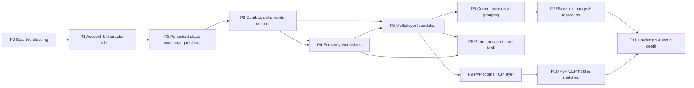

# WindSlayer EN 2008 Server: Implementation Roadmap

Lead-architect consolidation of the 12 system design docs (`re_tools/docs/systems/*.md`) and the UDP/gap spec batches. Date: 2026-09-17.

**Evidence order** (highest wins): client binary evidence in the spec > `LIVE_TEST_LOG.md` > server code > memory notes > PySlayer.

**Conventions**
- `ws:N` means `WindSlayer2Game/server/windslayer_server.py` line N (the file has 2793 lines). `wsproto:N` and `wsdev:N` refer to lines in the tool files next to it.
- Item ids are the designers' plan ids. `arch-*` ids are new cross-cutting items added in this roadmap.
- "alias" means a duplicate item merged into a canonical id. The canonical id is the one to implement; the alias is closed with it.
- S2C = server to client, C2S = client to server.

---

## 0. Executive summary

- **What the server is today.** A single-client dev harness:
  - Login and world entry work.
  - One map transition is byte-correct but replays hardcoded state.
  - Basic-attack combat works only through the memory-reading `_combat_driver` (ws:1737), which attaches to one local process.
  - All sessions get uid 1 (ws:2656).
  - Nothing is persisted except character creation.
  - Of the roughly 165 S2C and 89 C2S opcodes, about 20 are touched, and several of those are misrouted: C2S 0x38 goes to melee, C2S 0x25 goes to attack, C2S 0x63 is answered with the wrong S2C 0x63.
- **The protocol itself is no longer the risk.** Every live capture decodes byte-exact against `protocol_spec.json`. What is missing:
  1. correct packet construction: wsproto has two evaluation bugs that silently truncate packets;
  2. a truthful, persistent game-state model that mirrors what the client computes locally;
  3. multi-session infrastructure;
  4. a UDP room host for PvP.
- **Plan.** 12 phases (P0-P11).
  - P0-P4 are single-client and make one player's world truthful and persistent.
  - P5 is the multiplayer foundation.
  - After P5, three tracks can run in parallel: P6→P7 (social and exchange), P8 (premium cash), P9→P10 (PvP).
  - P11 is hardening.
- **Consolidation results.**
  - 236 designer items. 39 duplicate ids are merged into 22 canonical items (section 3.1), and 6 new `arch-*` items are added.
  - Every one of the 236 ids is placed in exactly one phase.
  - 21 dangling, circular or inverted `depends_on` entries are corrected (section 3.2).
  - 201 designer bug reports are consolidated into 79 entries: 17 S1, 48 S2, 14 S3 (section 2).

---

## 1. Cross-cutting foundations

### 1.1 Facts verified during this consolidation

These checks were run directly for this roadmap and settle open questions raised by several designers.

**1. Byte diff of `WindSlayer.exe` against `WindSlayer_patched.exe`.** `_p2` additionally changes the UDP port 42907→42908 at 4 sites, per project_multiclient. There are exactly 5 patch regions:

| File off / VA | Size | Original → patched | Meaning |
|---|---|---|---|
| 0x236E0 / 0x4236E0 | 27 B | `6a 01 05 10 27 00 00 50 8d 8e 38 0f ...` → 27×`90` | Room-map (mode 1) input SendTo to `host_ip:room_no+10000` is **removed**. No arena or battle UDP can leave these exes (UDP-C2S `0x4236F5/0x03`). |
| 0x3ED30 / 0x43ED30 | 2 B | `51 e8` → `db e9` | WM_TIMER jump table: the timer-2 "No response from the server" fallback is **removed**. Any unanswered enter-world wait is a permanent hang. |
| 0x4DFF9 / 0x44DFF9 | 15 B | `6a 01 68 9b a7 00 00 6a ff ff 15 ...` → 15×`90` | The post-login LAN probe broadcast UDP 0x11 to 255.255.255.255:42907 is **removed**, so C2S 0x2B `p2p_ip` stays empty. |
| 0x2F79FA / 0x6F79FA | 9 B | `121.160.9.165` → `127.0.0.1` | Server IP. |
| 0x2F81F3 / 0x6F81F3 | 47 B | patch URL → `127.0.0.1:7012/...` | Patch URL. |

- **Consequence.** The field-map UDP loopback (UDP-C2S `0x423787/0x04` snapshot and `0x4237FD/0x03` input, sent to 127.0.0.1:scene+0x244) is **intact** in every patched exe. The client simulates itself over its own UDP socket, and this needs no server. This answers combat_skill Q2: the loopback runs on our clients. Field multiplayer is **TCP-only** (0x04/0x05/0x06/0x1B/0x2A). UDP is only needed on mode-1 room maps: 9801-9804 arena, 9902 battle, 9903 play room.
- **wsproto.** The hex-literal bug is confirmed at wsproto:183 (`re.findall(r'[A-Za-z_]\w*', py)` turns `0x0A31` into `x0A31`). The missing `assume` is confirmed at wsdev:447 (`Grammar(spec['grammar']).encode(fields)`).
- **Map mode.** The map XML `mode` attribute stores values >1 minus 2 (UDP-SEND spec, FUN_00407190 @0x4076E7). The flea market 9701 (`mode=2`) is therefore a **normal field map** (mode 0). This answers world Q14 and shop_storage's 9701 question: no room handling is needed.
- **Line numbers.** The designers' citations spot-checked correct: ws:954/1540 chat count byte, ws:2656, ws:2307, ws:2044-2045, ws:148-159, ws:1986, ws:2023, ws:1659/1678/1737, and `_dispatch` at ws:601-667.

### 1.2 F1: Spec-driven packet codec (`arch` owner: world-codec-hexfix + lc-codec)

Every new packet is built and parsed from `protocol_spec.json` grammars. No more hand `struct.pack`.

1. **Fix `wsproto._eval`** (world-codec-hexfix). Replace `0x[0-9a-fA-F]+` literals with their decimal value before the identifier scan. Also strip C casts `(int)`: the 0x59 grammar `if((int)slot - 1 < 3)` currently drops `progress`.
   - Regression vectors from the designers:
     - C2S 0x0D with `ae=5` tail = 22 B, zero trailing bytes
     - 0x1B with ae+ie = 36 B
     - 0x07 with buff 0x0A32 = 379 B
     - 0x2E row with buff 0x0A32 = 331 B
     - 0x0C result 0x0B = 24 B
     - 0x7A result 0x64 = 22 B
     - 0x09 status 0x66 = 18 B
     - 0x72 item 0x0D50 emits hair_code
     - C2S 0x15 trap variant decodes x,y
     - C2S 0x06 `/stop` decodes
     - 0x59 {1,3} = `01 03`
   - Re-run `test_protocol.py` against all 285 specs and the live captures (0x07 369 B, 0x1A 89 B).
2. **`server/packets.py`** (lc-codec). Load the spec once and cache a `Grammar` per key.
   - API: `build(key, rec, assume=None)`, `parse(key, payload, allow_trailing=False)`, `send(session, key, **fields)`.
   - `send()` uses `session['no_enc']` of the **target** session and its `send_lock`.
   - S2C keys are the opcode (`'0x4F'`). C2S keys are the send-site key (`'0x4484CC/0x27'`). A C2S opcode with several send sites is resolved by length/shape.
3. **Receiver-state rule (assume table).** A grammar block gated on client state must never default to False. The server always knows the receiver's state, so it picks the matching form and sends only to receivers for whom that form is true. Per-key defaults:

| S2C | Condition to assume True | Send only when |
|---|---|---|
| 0x37 | `entity_with_uid_exists_in_scene` | receiver has the uid spawned (room member) |
| 0x5B | `find_entity_by_uid(uid) != null` | receiver has the uid spawned |
| 0x58 | `find_entity_by_uid(uid) != null` | observer on same map |
| 0x74 | `entity_with_uid_exists` | self and same-map observers |
| 0x61 / 0x62 | `client.messenger_room_id != 0` | receiver is in the room |
| 0x60 | friend-entry gate | receiver lists the friend (always 23 B) |
| 0x96 | local-player form | target client only (always 25 B) |
| 0x6F | bag gate (tab capacity ≤45) | every map load (after own 0x07) |
| 0x76 | local form 18 B for owner; 12 B observer form | per receiver |
| 0x72 | `duration_type` from `items.Cash_T`; random-look id set | owner + map |
| 0x2A | `move_bits_lo` branches | peers only, never the mover |

4. **Text safety** (lc-codec + chat_mail_gm-chat-builders).
   - `name17(s)` truncates to 16 bytes and NUL-pads. It is used for every `str[17]`; wsproto:285 never forces a NUL.
   - Per-opcode text clamps: 0x16 ≤60, 0x09/0x0A ≤60 (also `min(60, 78-len(sender), 80-len(target))`), 0x61 ≤58, 0x15 ≤88, 0x90/0x91 ≤87, 0x78 ≤92, 0x85/0x87 title ≤24.
   - Chat text is raw bytes end to end. Use cp949 only for logs.
5. **`wsdev.py sendspec --assume '{"cond": true}'`** plus `--to <uid|name>` (see F9).
6. **Spec errata** (`arch-spec-errata`; fix in the corpus, not the server):
   - (a) Add C2S `0x470018/0x32` FriendDelete `u32 friend_id, str[17] friend_name` (21 B). This is already derived by the TCP-C2S-32 gap batch.
   - (b) 0x59 grammar: `if(slot < 4)`.
   - (c) premium_cash.md §1.8 items 1-6. Example: the S2C 0x71 trigger belongs to C2S 0x47, not the 0x71 friend-warp site.
   - (d) Merge the UDP-RECV-A/B/C and UDP-SEND spec batches into `protocol_spec.json` under `UDP-S2C:*` / `UDP-C2S:*` keys with a UDP header note. Header bit 11 (0x800) means **encoded**; the server's `NO_ENCODE_FLAG` name is backwards.

### 1.3 F2: Handler registry and must-reply policy (`arch-handler-registry`)

Replace the `if/elif` `_dispatch` (ws:601-667) with a table `{opcode: (c2s_key, handler, fallback_reply)}`. Each C2S payload is decoded by grammar before its handler runs. Unhandled opcodes are logged with decoded fields.

Many C2S requests open the client modal **"Waiting for the server to response."** or set a client busy/lock flag. The patched exe also removed the timer-2 fallback. So **every one of these must get exactly one reply, even when the handler throws.** The registry sends `fallback_reply` from a `finally` block when the handler produced none.

| C2S | Client state left without reply | Minimal refusal (fallback) | Full handler item |
|---|---|---|---|
| 0x12 delete char | modal | 0x1F {2} | lc-delete |
| 0x2B enter world (unknown name) | wait dialog, no timeout in patched exe | re-send 0x02 character list | lc-enter-world |
| 0x15 skill (Type 3) | `scene+0x258` lock: no cast/equip | 0x5F | cs-skill-cast |
| 0x18 create room | modal | 0x30 (type<4) / 0xA2 (type 4) | pvp-room-create |
| 0x1A / 0x1B / 0x1C join room | modal | 0x34 {2, type} | pvp-room-join |
| 0x39 battle subscribe | modal | 0x39 + 0x20 {0} | pvp-battlefield-queue |
| 0x3A summon ready | modal | 0x20 {0} | pvp-battlefield-queue |
| 0x47 gift | modal | 0x71 {fail code} | premium_cash-gift |
| 0x48 use cash item | modal | 0x72 {uid,0,0} | premium_cash-use-generic |
| 0x49 rename | modal | 0x73 {0} | premium_cash-rename |
| 0x4A stat reset | modal | 0x76 local form, unchanged stats, serial 0, count 0 | premium_cash-stat-reset |
| 0x4B send note | modal | 0x77 {0} | social_friend-memos |
| 0x46 cash balance | re-sent on every restore | 0x70 {cash, mileage, 0} | premium_cash-balance-refresh |
| 0x51 password | dialog closes, nothing opens | 0x80 {0} | shop_storage-password-gate |
| 0x64 card register | modal | 0x8B {3} | quest_cards_misc-card-register |
| 0x5E / 0x5F / 0x60 stall | `ctx+0x20` selling, window can't close | 0x82 {2} / 0x83 {1} / 0x84 {1} | shop_storage-stall-open-close |
| 0x61 stall visit | window waits | 0x87 {0} | shop_storage-stall-browse-buy |
| 0x62 stall buy | window waits | 0x88 {0} | shop_storage-stall-browse-buy |
| 0x67 / 0x68 / 0x69 / 0x72 craft | busy flags `ctx+0x28/+0x2C` | 0x8D {0x0F,id} / 0x8E {0x11,eq,stone} / 0x8F {2,tool} / 0x9C {0} | item_inventory-crafting/-reinforcement/-gathering/-stone-extraction |
| 0x24 / 0x25 trade | Cancel/X disabled / confirm waits | 0x49 | trade-cancel-lifecycle / trade-lock-commit |
| 0x0B / 0x0C buy/sell refused | gold label stale | 0x18 {gold, victy, 0, 0} resync + 0x15 | shop_storage-npc-buy / -sell-parse |
| 0x5D village transfer | window waits | 0x81 {0} | world-village-transfer |
| 0x70 / 0x71 warp stones | window waits | 0x9A {0} / 0x9B {0} | premium_cash-region-warp / -friend-warp |
| 0x2E revive (death dialog) | player dead forever | MapTransfer to the current map's revive point | cs-player-death |

**Never reply to:**
- 0x05 keepalive: a reply resets state.
- 0x0D movement, to the sender: an echo desyncs the cipher.
- 0x2D / 0x75 list-close.
- 0x40 privacy.
- 0x37 messenger status.
- 0x44 memo delete.
- 0x7C dungeon exit (log only until instances exist).

### 1.4 F3: Identity model (lc-uid-online; aliases party-mp-identity, trade-mp-uid)

**Decision: uid is per ACCOUNT, not per character.** The client writes `scene+0x220` from the S2C 0x02 `account_id`, which arrives *before* character select (social_friend, login_character). The item_inventory doc's "per-character uid" wording is overridden.

- Persist `accounts[user]['uid']`: test=1, admin=2, then new = max+1.
- A duplicate login of an online account closes the old session and sends 0x02 result 4 to the new socket.
- Every per-player builder takes `uid` from the session. Remove all `char.get('uid', 1)` (ws:2212, 2232, 2260, 2307), `_send_level uid=1` (ws:1623) and the `_send_exp` default (ws:2011).
- The combat driver's `uid == 1` walk (ws:1774/1781) becomes "uid of the session bound to this pid" (party-dep-combat-multiclient).

**Id-space allocation (single table in `server/ids.py`):**

| Space | Range | Owner |
|---|---|---|
| Account/player uid | 1 .. 0x000EFFFF | store (F4) |
| Server monsters / NPC entities (0x1A) | 0x000F0000 .. 0x001FFFFF, server-wide allocator | world-shared-monsters |
| Client-local map-file NPC tiles | 33,000,000+ | client only; never allocate |
| Ground items | u16 per map, 1..0xFFFF (the 0x200000 base at ws:140 truncates to 0) | item_inventory-ground-loot-pickup |
| Room numbers | 1..128, skip 0x81 (cash-shop marker); shared by arena/play/battle | pvp-room-model |
| Messenger chat rooms | u32 counter, never 0 | social_friend-chat-room |
| Cash item serials | global, ≥0x1000 | premium_cash-wallet-model |

- Delete `_spawn_test_monster` (uid 0x1000 inside the player range) as part of world-cleanup.
- Character names are globally unique, compared case-insensitively, at most 16 bytes, `[A-Za-z0-9]` (lc-create). Name-addressed packets (0x4E, 0x28, 0x02 whisper, 0x30, 0x45) resolve via `world.by_name`.

### 1.5 F4: Persistence (lc-data-model is the store; field owners extend it)

**Decision: stay on `accounts.json` through P7.**
- A `store.py` owns load, migration, `db_lock` (RLock), a dirty flag with debounced save (≤2 s), and an atomic write (tmp + `os.replace`).
- Save triggers: disconnect, MapTransfer, level-up, trade/stall/gift commit, and a 60 s tick.
- Re-evaluate SQLite (`server/world.sqlite3`) at P8. Cash serials, gift inbox and audit logs are the growth drivers. Multi-account atomic commits (trade, stall, gift) are safe on JSON only because the whole file is swapped under one lock.
- This fixes the torn-file bug at ws:405-409.

**Single source of truth.** Every absolute value the client displays is read from the store, never from `session` defaults:
- gold (u64) goes to 0x03, 0x18, 0x19, 0x3F, 0x4A, 0x81, 0x95, 0x9D, 0x68/0x69, 0x88/0x89;
- Victy goes to 0x03 `winnie_points` and 0x18;
- exp goes to 0x02, 0x03, 0x07 level;
- manner goes to the 0x02 i32 and the 0x07/0x04/0x05 karma i32.

Delete `_DEFAULT_GOLD` / `_DEFAULT_WINNIE = 999999` (ws:994-995) and the 0x03 constants 100000 / 30000 (ws:2044-2045).

**Schema.** Union of all designers. Owner item in brackets.

- **account**
  - identity: `password` (salted hash later: lc-login-errors), `uid`, `gender` [lc-data-model], `banned`, `deleted`, `second_password` [shop_storage-password-gate]
  - reputation: `manner` (i32) [chat_mail_gm-gm-flag-manner], `social{compliment_given_day, complimented_accounts, compliments_received, report_day}` [social_friend-persistence]
  - cash: `cash`, `mileage`, `first_purchase_done`, `first_purchase_notice`, `cash_box[]`, `gift_inbox[]` [premium_cash-wallet-model]
  - `characters[≤5]`
- **character**
  - core [lc-data-model]: `name`, `created_at`, `class`, `job2`, `exp`, `look[14]`, `str/dex/int/spr`, `fame`, `rank_icon`
  - world [world-persistence]: `map`, `x`, `y`, `hp`, `mp`
  - wallet [shop_storage-wallet]: `gold` u64, `victy` u32
  - items [item_inventory-model-persist]: `inventory{equip:[{id,w[6]}], consume:{id:qty}, etc:{id:qty}, tab_slots[3]}`, `equipped{slot:{id,w[6]}}`
  - bank [shop_storage-bank-model]: `bank{slots, equip[], consume[], etc[], gold}`
  - skills [cs-skill-learn]: `skills[]`; buffs [cs-buffs]: `buffs[{id, remaining_ms}]`
  - quests [quest_cards_misc-quest-state-model]: `quests{active[3], progress[3], completed[[id,times]]≤85}`, `card_deck[≤51]`
  - social [social_friend-persistence]: `friends[]`, `friend_capacity`, `mentor`, `mentees[]`, `memos[{id,from,text,t[8]}]`
  - GM [chat_mail_gm-gm-flag-manner]: `gm`, `gm_hidden`
  - PvP [pvp-record-persistence]: `battle{win,lose,ko,down}`
  - cash [premium_cash-wallet-model]: `cash_items[]`, `hair`
  - `stall_escrow` [shop_storage-stall-registry]
  - `refuse{whisper,exchange,party,talk,friend}` [chat_mail_gm-privacy-flags]

**Migration (one-shot, lc-data-model):**
- existing `class` 1..4/101..104 → `look` slot 10; `class=0`, `job2=0`;
- look from `hair/face/top/bottom/shoes` into `[0,s1,0,0,s10,s5,s6,0,0,s9,s10,0,0,s10]`;
- `exp` from `level` via `exp_for_level`;
- account uids test=1, admin=2;
- new characters at map 101 (1411,714), not map 0 (100,100) (ws:2605-2606).

### 1.6 F5: World registry and session lifecycle (world-registry; aliases party-mp-registry, trade-mp-registry, chat_mail_gm-online-registry, social_friend-session-identity)

**`server/world.py`:**
- `World{by_uid, by_name(lower), maps{map_code: MapInstance}, lock: RLock}`
- `MapInstance{sessions, entities, ground, uid allocator, empty_since}`

**Session fields added:** `uid`, `char`, `in_world` (set after own 0x07, cleared before any server 0x03/0x08), `no_enc` (captured on every C2S in `_handle_fireway`), `send_lock` (created at construction, which fixes the `setdefault` race at ws:585), `current_map`, `pos{x,y,facing,t}`, `clock` (last 0x03/0x08 `game_time_ms` + Σ`logic_elapsed_ms`), `refuse`, `msgr_status`, `room_id`, `party_id`, `trade`, `stall`, `in_cash_shop`, `pw_ok{}`, `last_rx`.

**Outbound path.** Per-session writer queue and thread. Broadcasts enqueue under `world.lock` and never block on a peer socket. `send_seq` and cipher order are serialized per session.

**Lifecycle hooks** (each group registers callbacks; never inline in handlers):
- `on_enter_world` (after own 0x07):
  - presence: 0x04 to self, 0x05 to peers;
  - friend presence 0x60, mentor 0x7B/0x7D;
  - first-entry 0x15 welcome;
  - channel notice 0x99 sub 8.
- `before_server_map_load` (before 0x08/0x03/0x5E/0xA3/0xA4):
  - cancel trade (0x49 to both);
  - close stall: 0x84 {1} **before** 0x08;
  - leave messenger room (0x62 to others);
  - reset `msgr_status=0` and push 0x60;
  - 0x06 to old-map peers.
- `on_disconnect` (the `_handle_fireway` finally at ws:578):
  - trade cancel; party removal (0x51 plus frame compaction);
  - room/queue leave (0x2D / 0x62);
  - 0x60 offline, 0x7C/0x7D mentor;
  - 0x06 despawn; clear invites and escrow return; save.

### 1.7 F6: MapTransfer primitive (world-maptransfer; aliases premium_cash-map-replay-helper, pvp-warp-refactor)

`map_transfer(session, map_code, x, y, lead=0x08)`. It resolves the character and builds every packet first. Only then does it commit, fixing ws:1276/1283 committing before ws:1291.

1. `before_server_map_load` hooks, then persist.
2. `lead` ∈ {0x08, 0x5E, 0xA3, 0xA4}: `{u16 map_code, u32 game_time_ms=1000}`, exactly 6 B. ws:1282 wrongly sends the uid in the clock slot. Skipped at enter-world.
3. 0x03 from store (world-03-real-state).
4. Own 0x07 (world-player-record), then `in_world=True`, then 0x04 peers (≤5 records per packet).
5. 0x28 / 0x44 with **current** HP/MP. Today ws:1312-1315 sends max, which is a free full heal.
6. 0x1A batches (≤24 per packet, 23 with an effect entry). 0x11 ground items. 0x85 open stalls.
7. 0x6F owned cash list (P8; 0x03 memsets the cash tab).
8. The client then sends C2S 0x2F → 0x0B (+0x7E/0x78), and C2S 0x63 → 0x8A + 0x59 per active quest slot.

No `time.sleep` in handler threads (ws:1297-1317). The welcome 0x0A from "Server" (ws:1306) is removed.

Users of MapTransfer:
- portal 0x7E
- village 0x5D
- revive 0x2E
- warp stones 0x70/0x71
- GM /go
- mall exit 0x42
- room exits (0x1D 3/4, 0x5E/0xA3/0xA4)
- dungeon exit 0x7C
- dev `/warp`

### 1.8 F7: Content loading (`arch-content-loader`, `server/en_content.py`)

**Decision:** EN client assets are authoritative for ids, names, topology and client-computed rules. `gamedef.sqlite3` (KR, opened from `server/gamedef.sqlite3` explicitly) supplies only numbers the EN files lack. Every id is filtered through the EN catalog (1..4248).

| Data | Source | Loader item |
|---|---|---|
| Items / skills (Type, Kind, Lv, Job, HP/MP, CT, Con, Cash, Union, Buy/Sell/PMoney, CardSpr) | `hs/windslayer.hii` (+E9,DE,E0 mod 3, drop the 20 B SHA-1 footer; 4248 records) | item_inventory-en-catalog |
| Quests (Send/Demand 10×4 **decimal**, *_Num 10×3, Reward 20×4, Reward_Num 20×3, Job 21 flags) | `hs/windslayer.hqi` (291) | quest_cards_misc-en-quest-card-catalog |
| NPC shops / UI ids | `hs/windslayer.hni` (180) | shop_storage-en-content |
| Portals, arrival points, NPC tile placement | `hs/stageAA_BB.hmi` + `.hsi` line lists (FUN_00406170 order) | world-portal-table-en |
| 0x1A template indices | live dump of `game_state+0x4E0` (enum_container.py) | world-template-map |
| Exp table, stat totals, village fees, class names, fame ranks | exe tables 0x6F0C28, 0x70D07C/98/4C, 0x70C588, 0x6F11D8 | lc-exp-table, world-village-transfer |
| Monster HP/Def/Exp/Lv/speed/Drop; skill numeric verification | `gamedef.sqlite3` `npcs`, `items` (diff vs hii first) | world-template-map, cs-skill-defs |
| Spawn points, revive points, BF/room config, prices policy | authored `server/data/*.json` | world-shared-monsters, cs-player-death |

**Retire:**
- `quest_defs.py` hex parsing (242 of 291 quests wrong);
- the `_EN_ITEM_OVERRIDE` hack (ws:75-83);
- KR `portals.json` (237 of 594 EN portals missing, 20 malformed keys);
- `data/items.json` in item paths;
- `MONSTER_DB` names ("Seeyo" → "Pupu").

### 1.9 F8: Tick scheduler (`arch-tick-scheduler`, `server/ticks.py`)

One heap-scheduled thread replaces ad-hoc timers. Every callback runs under `world.lock`.

| Timer | Period | Item |
|---|---|---|
| monster despawn (0x06 ~3 s after death) and respawn (0x1A) | per mob | cs-monster-death |
| HP/MP regen | 15 s | cs-regen |
| buff expiry 0x43/0x3C | 50 ms resolution | cs-buffs |
| DoT 990 ms, Healing Aura 5010 ms | | cs-debuffs, cs-party-skills |
| party vitals coalesce | 250 ms | party-vitals-sync |
| invite TTLs: party 60 s, trade 30 s, friend 120 s, messenger 60 s | | owners |
| period cash item expiry | 60 s | premium_cash-expiry |
| idle reaper (`last_rx` >300 s) | 30 s | quest_cards_misc-keepalive-reaper |
| save debounce / 60 s autosave | | lc-data-model |
| maintenance countdown 180 s, battlefield summon timeout | | chat_mail_gm-gm-stop-kick, pvp-battlefield-queue |

The respawn tick must not depend on C2S traffic. Today `_tick_respawns` runs only on 0x38/0x25 (ws:1638/1847).

### 1.10 F9: Test infrastructure

**Offline fake client** (chat_mail_gm-offline-dispatch-tests, generalized). `server/tests/fakeclient.py` pairs a socket with CEncMsg, feeds C2S payloads to the handler registry and decodes S2C replies with grammars. Every handler lands with an offline test before any live run.

**Single-client input tooling** (chat_mail_gm-harness-typing; aliases item_inventory-harness-drag-dblclick, lc-harness-charselect). New wsview/wsdev commands:
- `type "text"` with `/` 0xBF, `-` 0xBD, `.` 0xBE and shift chords;
- `rclick x y` (popup 0x50 needs WM_RBUTTONUP 0x205);
- `dclick x y` (WM_LBUTTONDBLCLK 0x203);
- `drag x1 y1 x2 y2`;
- `wsdev up --select` (stop at character select).

**Multi-client targeting** (party-test-harness; aliases trade-harness, social_friend-harness-multiclient):
- admin JSON gets `target` (uid or name) and defaults to `in_world` sessions only. ws:459-461 currently sends to every session, including character select, where SubHandler3 packets deref a NULL `CMessenger+0x74`.
- `sendspec --to`;
- wsview `--pid`;
- in-world probe by session uid;
- auto-login admin/admin on `WindSlayer_p2.exe`.

**UDP injector** (`arch-udp-inject`, P9). `wsdev udpsend <port> <opcode> '{json}'` frames the Fireway UDP header (size | 0x800 | seq<<12, checksum, EncodebyArray) to 127.0.0.1:42907 or 42908.

### 1.11 F10: Combat authority transition (cross-cutting risk owner)

- The EN basic attack sends **no packet**. Field hits are computed client-side and never written. Today the server learns swings by reading client memory (`+0x8B8`, `+0x15B4`, position `+0x11F8/+0x1288`), which works only on the same machine and for one pid.
- **Dev path** (party-dep-combat-multiclient, P5): bind each attached pid to its session uid and apply swings only to that session.
- **Production path** (world-move-relay + world-position-estimate + cs-skill-damage):
  - swing = C2S 0x0D state blob `ae` ∈ 1..5 (the 22 B form carries `event_source_uid`);
  - facing = `lo` bits 20-21;
  - position = last `ie` tail plus dead reckoning;
  - hitbox = `SKILL_HITBOX[family]`.
- **Spike S-1** (P5, before shared monsters ship): hold S next to a Pupu while running `wsdev cap`. Measure how often 0x0D carries `ae`, how often the `ie` position tail appears, and the dead-reckoning error against memory truth (T-0D-4, T-05-3).
  - If position error exceeds a hitbox half-width (~40 px), escalate to an optional exe patch that appends position to every 0x0D (decision gate G1).

### 1.11a F11: UDP requirements

- **Field maps: none.** The client feeds itself via the loopback (verified intact, 1.1). The server must never send UDP 0x04/0x03 to a field client, and must never run the old `_fake_map_server` UDP 0x11 helper (ws:862-898). Its 0x11 makes the client overwrite `scene+0x224` p2p_ip.
- **Room maps (mode 1): the server is the UDP host** (pvp-udp-host).
  - One socket per room at `server_ip:10000+room_no` (bind 10001..10128).
  - Peers are learned from UDP-C2S 0x03 source addresses. The client sends first, so NAT works.
  - Sends snapshots 7/8/9 by round phase, HP 6/0x0C/0x0E, MP 0x0B/0x0D/0x0F/0x10, heal 0x0A.
  - Needs `WindSlayer_arena.exe` / `_arena_p2.exe` with the 27 bytes at 0x236E0 restored (pvp-arena-client-exe).
  - Host IP string in S2C 0x2F must be the address the client can reach (config PUBLIC_IP).
- **Alternative** (decision gate G2, pvp-mode1-sim-spike): patch the FUN_0042b260 mode compare so room maps run the mode-0 local simulation, and relay over TCP. That avoids a full UDP host.

### 1.12 F12: Configuration (`arch-config`, `server/config.json`)

- Ports: version 7011, game 7022 (hardcoded in client VA 0x44080E), admin 7099, UDP room base 10000.
- `PUBLIC_IP`, channel list, notice, maintenance flag (lc-version-config).
- `START_MAP/X/Y`, `REVIVE_POINTS`, `BF_MATCH_SIZE` (12 retail, 2 for tests), `ARENA_ROOM_LIMIT`, `PLAY_ROOM_LIMIT`.
- Dev flags: `DEV_MEMORY_COMBAT`, `DEV_FREE_NOTES` (note items without cash inventory until P8), `CREATE_REPLY_0x02`, `PARTY_CHAT_0x16_FALLBACK`.

### 1.13 Resolved cross-designer conflicts

| # | Conflict | Decision |
|---|---|---|
| D1 | uid per account (social, login) vs per character (item) | Per account (0x02 precedes select). |
| D2 | uid range <0x1000 (social) vs ≤0xEFFFF (trade/login) | 1..0xEFFFF; delete the 0x1000 test mob. |
| D3 | Movement relay 0x2A (0x2A spec) vs 0x1B (0x0D/0x1B specs) | 0x1B relay with `hold_ms = logic_elapsed_ms`; 0x2A only for server keyframes; 0x9E stop (world §1.4). |
| D4 | Monster death owned by world-entity-lifecycle ↔ cs-monster-death (each depended on a nonexistent id of the other) | Canonical **cs-monster-death**: 0x29 `respawn_tick=0x7FFFFFFF` + home x,y; 0x06 after ~3 s; ticker respawn 0x1A; exactly-once kill under combat_lock. |
| D5 | Password gate 0x51/0x80 (premium vs shop) | One handler **shop_storage-password-gate**. Allowlist {0x1A7 bank, 0x1F9 gift, 0x235}. Delete `_build_opcode_80`/`_send_cash_balance` (ws:1107-1132). Core does not depend on the bank model; 0x65 is sent only for 0x1A7. |
| D6 | Memo/note ownership (social memos vs chat memo-delivery) | Canonical **social_friend-memos** (store, 0x78 delivery, resend on 0x2F, 0x44 delete with delivered-id guard). chat_mail_gm-note-reply-9999 extends it. Note-item consumption soft-depends on premium_cash-cash-inventory-api; `DEV_FREE_NOTES` until P8. |
| D7 | Report result (social vs chat) | Canonical **chat_mail_gm-report**. |
| D8 | Rename (premium vs login) | Canonical **premium_cash-rename** using lc-create name rules. |
| D9 | Mentor exp share 0x7F (social vs login) | Canonical **social_friend-mentor-exp-share**. |
| D10 | Kick/maintenance (chat GM vs quest admin JSON) | Canonical **chat_mail_gm-gm-stop-kick**; admin JSON is a second entry point. |
| D11 | Play-room delete `/delroom` (pvp) vs `/proom` (chat) | `/proom` in chat_mail_gm-gm-shadow-reset-proom; pvp-moderation provides the teardown routine. |
| D12 | Stall visit 0x61 (trade stub vs shop) | shop_storage owns it; trade-stall-visit is an alias of shop_storage-stall-stub. |
| D13 | Privacy flags (5 designers) | Canonical **chat_mail_gm-privacy-flags**: decoded once in lc-enter-world (0x2B bytes 0-4) plus a C2S 0x40 handler; consumers call `refuses(target, kind)`. quest_cards_misc-privacy-flags had inverted deps (it depended on its consumers); fixed. |
| D14 | cs-skill-learn ↔ shop_storage-npc-buy cycle (via "SS-4") | `skills.learn()` has no shop dependency; npc-buy calls it. |
| D15 | world-03-real-state ↔ quest_cards_misc-03-quest-card-fields | 0x03 builder takes provider callbacks (wallet, inventory, quests, cards, mentor, battle); providers register later. |
| D16 | Victy vs Wind Cash naming (`winnie`) | `winnie` renamed `victy` (character). Wind Cash/Mileage are account fields used only by mall packets. |
| D17 | Welcome message | S2C 0x15 `[Announce]` once per connection on first entry; no 0x0A. |
| D18 | Party chat reply | S2C 0x90 to all members including the sender; 0x16 behind flag pending T-CHAT. |
| D19 | 0x63 handling (pvp: stop replying; quest: reply 0x8A) | Canonical **quest_cards_misc-stop-0x63-echo**: C2S 0x63 → S2C 0x8A (deck) + 0x59 re-arm; S2C 0x63 (3 B) only in answer to C2S 0x38. |
| D20 | Persistence backend | JSON store with atomic swap through P7 (F4). |

---

## 2. Consolidated server bug list (de-duplicated)

**Severity:**
- S1 = crash, cipher/state desync, permanent soft-lock or exploit.
- S2 = wrong behavior.
- S3 = cosmetic, mislabel or dead code.

"Groups" lists the designers who reported the defect. Fix items are canonical ids.

### 2.1 S1: crash / desync / soft-lock / exploit

| ID | Opcodes | Defect | Evidence | Fix (item, phase) | Groups |
|---|---|---|---|---|---|
| S1-01 | codec: C2S 0x0D/0x15/0x06, S2C 0x07/0x04/0x05/0x2B/0x2E/0x0C/0x7A/0x09/0x72/0x1B/0x2A | `wsproto._eval` reads hex literals as client-state names (`0x0A31`→`x0A31`), so every condition containing a hex literal is False. Tails are dropped, buff params are omitted (0x07 375 B not 379), success layouts are sent as failure layouts. | wsproto:183; reproduced by 7 designers | world-codec-hexfix (P0) | all |
| S1-02 | codec/tooling: 0x37, 0x5B, 0x58, 0x74, 0x60, 0x61, 0x62, 0x96, 0x6F, 0x72, 0x76 | `Grammar.encode` without `assume` omits client-state blocks (0x61 → 0 B, 0x96 → 8 B of 25, 0x6F → 0 B). `sendspec` cannot pass `assume`. Server builders written naively would truncate packets. | wsproto:293-298; wsdev:447 | lc-codec + assume table (P0) | pvp, premium, social, chat, login |
| S1-03 | S2C 0x59 | Grammar `if((int)slot - 1 < 3)` makes `int` an unknown name, so progress is dropped (1-byte packet). | quest doc; verified encode `01` | world-codec-hexfix (cast strip) + arch-spec-errata (P0) | quest |
| S1-04 | 0x02, 0x07, 0x1D, 0x1E, 0x22, 0x04/0x05, 0x2E/0x2C/0x2D, 0x48/0x4B, 0x85, 0x4F | Every login gets uid 1; builders default `char.get('uid',1)`. With two clients a peer record re-registers the receiver's local player; 0x2D frees the receiver's own entity (dangling `scene+0x970`); 0x48/0x4B always take the self branch. | ws:2656, 2307, 2212, 2232, 2260, 2011, 1623, 1774/1781 | lc-uid-online + world-player-record (P1) | all multiplayer groups |
| S1-05 | S2C 0x03 | Hardcoded and replayed on every portal: clock 1000, gold 100000 (wallet says 999999), `exp_total 30000` (client auto-levels to 13 on +485 exp), empty quests / completed / cards / three item lists, memset of bag and cash tab. Enter-world ignores the saved map. Result: bag and quest log wiped every portal; gold jumps on the next 0x18. | ws:2035-2081, 2044-2047, 2060-2079; call sites 733 (no `current_map`), 1298 | world-03-real-state + shop_storage-wallet + lc-exp-persist + item_inventory-seed-03-07 + quest_cards_misc-03-quest-card-fields (P1-P2) | world, item, trade, shop, quest, login |
| S1-06 | S2C 0x21/0x22 | `EXP_TABLE` holds per-level increments but is treated as cumulative (98 entries, not 99). Server and client disagree on level (176 exp: 3 vs 2; 30000: 18 vs 12), and 0x22 forces the wrong level. | ws:148-166, 2010-2012; exe 0x6F0C28 | lc-exp-table (P1) | login |
| S1-07 | S2C 0x29 / 0x1A | Death sends `respawn_tick=0`, `x=y=0`, so the client revives the corpse at (0,0) and resets the leash home. Server respawn re-sends 0x1A for a live uid, creating a duplicate entity. Respawn runs only on C2S 0x38/0x25, so kills made through the driver never respawn. | ws:1986-1992, 2023-2033, 1638, 1847; FUN_00413920 case 0x16 | cs-monster-death (P0) | combat, world |
| S1-08 | all S2C; accounts.json; combat | (a) `send_lock` created by `setdefault` is not atomic, so cross-thread sends can interleave cipher sequence. (b) `_save_accounts` truncates and rewrites with no lock, so concurrent writes or a crash tear the file. (c) The driver iterates `mons.values()` while `_spawn_map_monsters` replaces the dict: RuntimeError swallowed, handle dropped; double death/exp/drop. | ws:585; 405-409; 1686 vs 1823-1841, 1811-1813 | world-registry, lc-data-model, cs-combat-lock (P0-P1) | trade, social, login, combat |
| S1-09 | C2S 0x12, 0x2B(unknown), 0x18, 0x1A, 0x1B, 0x1C, 0x39, 0x3A, 0x47, 0x48, 0x49, 0x4A, 0x4B, 0x64, 0x51, 0x24/0x25, 0x5E/0x60 | Requests that open the modal "Waiting for the server to response." (or set a lock) get no reply. 0x1A is swallowed as "mob query"; 0x2B for an unknown name returns silently. The patched exe removed the timer-2 fallback, so the UI hangs permanently. | `_dispatch` ws:601-667 (else ws:659), 641-643, 715-717; patch diff 0x43ED30 | arch-handler-registry fallbacks + pvp-modal-guard, social_friend-note-stub, shop_storage-stall-stub, item_inventory-interim-craft-replies (P0); lc-delete, lc-enter-world (P1) | pvp, premium, social, login, quest, shop, trade |
| S1-10 | C2S 0x15 (Type 3) | A skill cast gets no reply, so `scene+0x258` stays set: no further casts, and every equip/unequip says "You can't equip or unequip while attacking." until a map load. Skill 194 Open Stall is unreachable. | ws:1187-1191 | cs-cast-unlock (P0) → cs-skill-cast (P3) | combat, shop, item |
| S1-11 | C2S 0x16, S2C 0x26/0x59/0x27 | (a) A repeated 0x16 for an active quest is treated as turn-in, and an empty demand list counts as met. After a portal wipes the client log, re-accepting pays rewards with no kill (exploit). (b) Talk-only quests get a server slot, so later 0x59 packets write another slot's progress. | ws:1378-1386, 1418-1420, 1389-1398 | quest_cards_misc-accept-rework, -turnin-0x17 (P2) | quest |
| S1-12 | C2S 0x25, C2S 0x38 | TradeFinalConfirm is routed to `_handle_attack`: item ids 0..7 become mob uids 0xF0000+id, damaged (1.5× with gold) and killed for exp/drops (exploit). The Battlefield T key runs `_handle_melee` on the nearest mob. | ws:644-652, 1844-1881, 1889-1897, 1634-1653; LIVE_TEST_LOG T capture | cs-dispatch-fix, pvp-dispatch-cleanup (P0) | combat, trade, pvp |
| S1-13 | C2S 0x0E; str[17] in 0x45/0x46/0x4E/0x4F/0x0C/0x0D/0x0E/0x10/0x60-0x62/0x7A/0x94/0x96 | Names up to 17 bytes are accepted and the encoder never forces a NUL, so client strcpy/sprintf over-reads or overflows the stack. No uniqueness check, so name routing is ambiguous. | ws:2590, 2601-2612; wsproto:285 | lc-create + `name17` (P0/P1) | social, trade, party, login |
| S1-14 | S2C 0x16/0x09/0x0A/0x61/0x15/0x90/0x91 | Outbound text is capped at 255 bytes; client stack buffers hold 61 (0x16) / 88 / 87 bytes (latent stack overflow). | ws:953, 1539 | chat_mail_gm-chat-builders clamps (P0) | chat |
| S1-15 | admin injection | Injector sends to every session, including character select (NULL `CMessenger+0x74` deref for SubHandler3 packets). No per-client target. | ws:459-461 | party-test-harness (P5; `in_world` filter pulled into P0) | social, trade, party |
| S1-16 | S2C 0x07 equip grid / 0x1E / 0x24 | The grid always sends zero option words. After reinforcement, a portal stores a zero block, so 0x1E cannot clear the slot but adds a bag copy (duplication); 0x24 does nothing. | ws:2351-2358 | item_inventory-seed-03-07 (P2) | item |
| S1-17 | UDP room input | All patched exes NOP the room SendTo (27 B at 0x4236E0), so no arena, battle or play-room match is possible. The LAN probe (0x44DFF9) is also NOPed, so 0x2B `p2p_ip` is empty. | byte diff (1.1) | pvp-arena-client-exe (P9) | pvp |

### 2.2 S2: wrong behavior

| ID | Area / opcodes | Defect | Evidence | Fix (item) |
|---|---|---|---|---|
| S2-01 | C2S 0x63 → S2C 0x63 | Empty S2C 0x63 (BattlefieldQueueCounts u16+u8) on every map load: Fireway short reads, garbage Battlefield labels; deck 0x8A never sent. | ws:610-611 | quest_cards_misc-stop-0x63-echo |
| S2-02 | C2S 0x2C | Reads a byte EN does not send; never sends 0x33; the arena list is always empty. | ws:653-654, 1529-1533 | pvp-room-lists |
| S2-03 | C2S 0x2F | MessengerFriendListRequest ignored as "arena query": friend window (0/0); Add Friend always "Visit Frenaiga". | ws:630-631 | social_friend-friend-list-sync |
| S2-04 | unhandled families | No handlers: items 0x11/0x13/0x14/0x1F quests 0x17/0x1E party 0x27/0x28/0x29/0x6A trade 0x20-0x26/0x61/0x62 chat 0x02/0x06/0x6B/0x6E messenger 0x30-0x37/0x5C/0x50/0x6D/0x73 privacy 0x40 cash 0x42-0x4C/0x51/0x70/0x71 bank 0x3C-0x3F village 0x5D crafting 0x67-0x69/0x72 rooms 0x74/0x75/0x1D/0x3B revive 0x2E trap 0x6C dungeon exit 0x7C | ws:659 else-branch | per-phase handlers (section 3) |
| S2-05 | S2C 0x16 chat | Extra leading `u8 1` erases the text ("test :"); all six `_send_chat_line` notices render blank. | ws:954, 1540; callers 1020/1347/1356/1375/1383/1440 | chat_mail_gm-chat-builders, -system-notices |
| S2-06 | C2S 0x03 chat | Speaker is the account name, not `char_name`; echoed only to the sender. | ws:949, 955; live bug 3 | chat_mail_gm-chat-builders, -map-chat-broadcast |
| S2-07 | C2S 0x0F / S2C 0x1D+0x23 | Equipping one of two identical items removes both (0x1D already removes the bag copy; 0x23 removes the second). | ws:1513-1523; live bug 5 | item_inventory-no-double-remove |
| S2-08 | C2S 0x0F | Equip handler: u16-only decode with a zero block echo (socketed gear fails), 0x1D sent before the ownership check (free equip), old item not returned to the model, KR Kind table (289 items differ), no Lv/Job/Gender check. | ws:1493, 1508, 1513, 1517, 73 | item_inventory-equip, -kind-slot-table |
| S2-09 | S2C 0x26/0x27 + 0x18 | Quest Send/Reward items and gold are also sent as 0x18: duplicate items, gold overwritten. | ws:1362-1372, 1427-1434; live bug 4 | item_inventory-quest-grant-mirror, quest_cards_misc-turnin-0x17 |
| S2-10 | quest content | `quest_defs.py` parses ids/counts as hex and Reward as 10 entries; 242 of 291 quests wrong (Double Jump 94 lost); `_EN_ITEM_OVERRIDE` hack. | quest_defs.py:14-24; ws:75-83 | quest_cards_misc-en-quest-card-catalog |
| S2-11 | S2C 0x18 drops | KR-only ids (4356) credited server-side but ignored by the EN client. | ws:113-128, 1918-1922; live bug 6 | item_inventory-en-catalog |
| S2-12 | quests | Repeatable quests never re-acceptable; no kill (ReqPro) credit; 0x59 carries an item count as progress; no abandon 0x1E→0x38; no server accept validation. | ws:1353, 1911-1928, 1443-1456, 1353-1376 | quest_cards_misc-accept-rework, -kill-progress, -abandon-0x1E |
| S2-13 | C2S 0x11 | Unequip unhandled; item stays worn. | `_dispatch` | item_inventory-unequip |
| S2-14 | C2S 0x15 potions | No 0x25: count never decrements, no cooldown. `_inv_remove` pops the key so the ownership gate always passes. Absolute 0x28/0x44 would double-apply once 0x25 exists. | ws:1160-1231, 1153, 1195-1198 | item_inventory-use-consumable |
| S2-15 | ground items 0x12/0x13/0x1F | 0x12 builder misaligned (quantity=x, ground_id=0, drop_time=0x200000); 0x13 mislabeled; `GROUND_ITEM_UID_BASE` truncates; no pickup handler; loot goes directly to the bag. | ws:140, 1700-1730, 1917-1927 | item_inventory-ground-loot-pickup |
| S2-16 | 0x67/0x68/0x69/0x72 | Crafting, reinforce, gather, extract never answered; busy flags stay set. | `_dispatch` | item_inventory-interim-craft-replies → full items |
| S2-17 | inventory model | `{id: count}` with no tabs or 12-byte option blocks; Type-1 items added with count>1; skill books added as phantom bag items. | ws:1137-1158, 1024, 1370, 1430 | item_inventory-model-persist, cs-skill-learn |
| S2-18 | C2S 0x0C sell | Quantity parsed as u8 (300→44); descriptor ignored; refusal silent. | ws:1039, 1040-1042 | shop_storage-sell-parse |
| S2-19 | C2S 0x0B buy | No shop-list, Cash, PMoney/Victy, level/class or discount checks; KR prices; refusal sends chat only with no resync. | ws:1011-1021 | shop_storage-npc-buy |
| S2-20 | S2C 0x80 | Built as "CashShopBalance" with a balance in the window-id field; if sent it would open window 999999 (latent). | ws:984-986, 1107-1132 | shop_storage-password-gate |
| S2-21 | bank / stall | Bank 0x51/0x65-0x69 and stall 0x5E-0x62 unhandled; 0x07 `shop_open` always 0. | `_dispatch`; ws:2395 | shop_storage-bank-*, -stall-* |
| S2-22 | persistence | Exp, gold, inventory, equipment, quests, map/pos, HP/MP live only in the session; relog loses all; first kill after relog regresses level. | ws:1995-2003, 578-580, 2612 | lc-data-model, world-persistence, lc-exp-persist |
| S2-23 | S2C 0x02 | `job_branch` = level (class-name table overrun at L≥3); total_exp 0 (always Lv.1); ranks mislabeled. | ws:2687-2690 | lc-charlist |
| S2-24 | C2S 0x0E | Look slot 10 stored as class: characters born Warrior/Monk/Archer/Rogue, not Novice; class >6 breaks HP/MP recompute. | ws:2585, 2603 | lc-create, lc-data-model migration |
| S2-25 | S2C 0x02/0x07 look | Appearance array mis-slotted (constant 123 in slot 1, etc.); probable cause of live bug 8 "unclothed". | ws:2694-2711, 2332-2346 | lc-charlist, lc-spawn-fields |
| S2-26 | S2C 0x07 fields | Stats sent as 0, cur_hp/cur_mp 0 (remote record renders dead), karma 1 vs 0x02 manner 0, gender 0 (491 "(M)" items unequippable), `gm_level` 0 labelled field12. | ws:2308, 2329, 2348-2349, 2391-2392, 2319-2323 | world-player-record, lc-spawn-fields, chat_mail_gm-gm-flag-manner |
| S2-27 | S2C 0x07/0x1A idle state | Movement state seeded non-idle (IP octets at +0x8B3..6, 954=32, 8CF=1, 904=0, E00=501); remote records would walk; monsters static/invisible. 0x1A also carries effect 0xB3B mislabeled "idle action". | ws:2367-2387, 1574-1593 | world-player-record, world-1a-defaults |
| S2-28 | C2S 0x04 stats | Every allocation answered with absolute value 4; no validation or persistence. | ws:957-966 | lc-stats |
| S2-29 | C2S 0x0E create | No name rules, uniqueness, 5-char cap, stat-sum check or 0x1C error replies. | ws:2581-2617 | lc-create |
| S2-30 | S2C 0x01 version | Game IP 127.0.0.1 and user_count 0 hardcoded; remote clients can't connect. | ws:333, 338 | lc-version-config |
| S2-31 | C2S 0x0D | Not parsed or relayed; `session x/y` never set, so server melee uses the saved position. | ws:669-684, 1640-1641 | world-move-relay |
| S2-32 | presence | No 0x04/0x05/0x06. Disconnect only deletes the session (no despawn, party/trade/room cleanup). The client blocks 0x20/0x27/popup 0x50 without a remote entity. | ws:578-581 | world-registry, world-presence |
| S2-33 | monsters | Per session, not per map (private sets with identical uids); template index = npccode (only Pupu binds; NULL `+0x11DC` nameplate risk). | ws:1823, 1832, 1839 | world-shared-monsters, world-template-map |
| S2-34 | portals C2S 0x7E | KR `portals.json`: 237/594 EN destinations missing, 228 phantom pairs, 132 wrong arrivals, 20 malformed keys; no `in_world`/cooldown/index-0 guard; map change commits before the character resolves. | ws:1244-1275, 1276-1291, 1326 | world-portal-table-en, world-portal-guards, world-maptransfer |
| S2-35 | HP/MP | Portal refills to max; session max = saved 100 vs client 110; no regen (the client regens only as room host). | ws:1312-1315, 777-783; FUN_00417e10 | cs-hp-mp-model, cs-regen |
| S2-36 | C2S 0x5D | Village transfer unhandled; no 0x81. | `_dispatch` | world-village-transfer |
| S2-37 | combat driver | Attaches only to `windslayer_patched.exe`; applies one client's swings to every session's monsters. | ws:1659-1698, 1773-1784 | party-dep-combat-multiclient |
| S2-38 | C2S 0x2B | Refuse flags (bytes 0-4) and P2P endpoint (str[16] ip + u32 port) ignored; docstring "zeros/magic"; C2S 0x40 unhandled. | ws:686-705 | lc-enter-world, chat_mail_gm-privacy-flags |
| S2-39 | S2C 0x03 social | `mentor_id` always 0; server-sent 0x03 wipes messenger state (room +0xCC, status +0x9C) without room leave or status reset. | ws:2059, 1298-1300 | social_friend-mentor, world-registry hooks |
| S2-40 | S2C 0x03 / 0x6C tabs | Tab capacities hardcoded 35/35/35; purchased slot extensions revert; non-multiples of 5 overflow 45. | ws:2071-2073; FUN_0045E9F0 | item_inventory-seed-03-07, premium_cash-owned-list-sync |
| S2-41 | S2C 0x6F | No owned-cash list after map load (0x03 wipes the cash tab); dead 28-zero-byte block would purge the cash bag. | ws:733-787, 1280-1320, 789-821 | premium_cash-owned-list-sync |
| S2-42 | 0x18/0x03 currency | Victy (`winnie`) conflated with Wind Cash; 0x03 says 0 while 0x18 says 999999. | ws:980, 995, 2047 | shop_storage-wallet, premium_cash-wallet-model |
| S2-43 | S2C 0x21+0x22 | Owner receives 0x22 after 0x21: level-up effect plays twice; a negative exp change would play a level-up. | ws:2006-2013 | lc-exp-persist |
| S2-44 | tooling input | wsview can't right-click, double-click, drag or type `/`, `-`, capitals. | wsview.py:163-181, 198-203 | chat_mail_gm-harness-typing (+aliases) |
| S2-45 | S2C 0x07 room/cash marker | +0xE2 labelled "marriage"; it is room_no (0x81 = mall), +0xE1 type, +0xD0 title. | ws:2310-2317 | premium_cash-presence, pvp-room-balloon |
| S2-46 | 0x02 flags | `unknown_1` = cash_first_purchase_flag, `has_premium` = account gender, `premium_flags` = manner; 16 trailing bytes. | ws:2666-2678, 2713-2714 | lc-charlist |
| S2-47 | escrow (latent) | Sell/equip/use/quest consume ignore trade escrow; offer-then-sell will duplicate once trade exists. | ws:1040-1044, 1517-1520, 1195-1221, 1424-1425 | trade-escrow-guards |
| S2-48 | mall + driver (latent) | Preview avatar in the mall uses the local uid; driver/respawn/wander would act on the preview scene. | ws:1678, 1737-1810 | premium_cash-mall-enter (freeze tickers) |

### 2.3 S3: cosmetic, labels, dead code

| ID | Item | Evidence | Fix item |
|---|---|---|---|
| S3-01 | C2S 0x2D labelled "scene-finalize ack" (it is ArenaRoomListClose) | ws:655-658 | pvp-dispatch-cleanup |
| S3-02 | Welcome as a fake 0x0A whisper from "Server" (adds "Server" to the whisper list; repeats every portal) | ws:765-772, 1306-1309 | chat_mail_gm-system-notices |
| S3-03 | Chat text ASCII-replaced (cp949 → `?`) | ws:948, 953, 1538 | chat_mail_gm-chat-builders |
| S3-04 | 0x08 body carries uid in the `game_time_ms` slot + 4 extra bytes | ws:1282 | world-maptransfer |
| S3-05 | Double fade per portal + six 50 ms sleeps in the receive thread | ws:1283/1300, 1297-1317 | world-maptransfer, world-single-fade |
| S3-06 | Dead/wrong builders: `_build_map_enter_packet` (0x2F layout called 0x2E), `_build_enter_world_response`, `_build_pyslayer_enter_world`, `_build_pyslayer_opcode_07`, `_fake_map_server` + UDPMapServer (sending UDP 0x11 would corrupt p2p_ip), `_spawn_test_monster` | ws:900-939, 2472, 2410, 2083, 862-898, 2724-2760, 1602 | world-cleanup (+pvp-stale-cleanup) |
| S3-07 | Dead combat code: `_handle_use_skill`, `_send_hit_feedback`, `_handle_attack`, `_handle_melee`; 0x40 docstring "hurt" (it is heal visuals); `_build_opcode_29(anim,dx,dz)` misnames respawn fields | ws:1458-1465, 1972-1984, 1944-1962, 1986-1992 | cs-cleanup |
| S3-08 | Dead item builders `_build_en_opcode_1D` (N=14 overflow), `_build_en_opcode_1E` ("merge"), 0x23 docstring | ws:2192-2266, 1079-1101 | item_inventory-dead-code-cleanup |
| S3-09 | Shop comment block: 0x47091D called shop listing (it is S2C 0x0B FriendList), `u8 undef` = high byte of npc_id | ws:969-991, 975-976 | shop_storage-cleanup |
| S3-10 | 0x14 called monster HP; unused `_build_opcode_14`; 0x2B docstring "10.5.0.2 / 0xA79B magic"; game port documented as 7012 | ws:88, 1817, 1930, 689-695, 10, 286, 364, 376 | lc-enter-world / cleanup |
| S3-11 | `MONSTER_DB[1]` "Seeyo" vs client "Pupu" | ws:114; live bug 7 | world-template-map |
| S3-12 | Idle/dead connections never reaped | ws:526-529 | quest_cards_misc-keepalive-reaper |
| S3-13 | `NO_ENCODE_FLAG` name is inverted (bit 11 = encoded) | UDP-S2C:0x03 framing spec | lc-codec |
| S3-14 | Exe class-name table row 2 shifted (Warrior tier 2 shows "Counter") | 0x70C588 | lc-classname-patch |

### 2.4 Stale notes and docs to correct (lead action; not server code)

- `reference_combat_model.md`: S2C 0x40 is heal visuals, not "flinch+sound". C2S 0x38/0x25/0x1E are not combat.
- `reference_combat_render.md`: 0x1D **removes** the matching bag copy. The 0x1A "idle action 0xB3B" is a Mutation effect slot.
- `project_status.md`: "inbound 0x25 attack", "0x14 mob HP" and "accept+turn-in share 0x16" are wrong (turn-in is C2S 0x17). The "two SendTo patches" are the room SendTo 0x4236E0 and the LAN probe 0x44DFF9.
- `social_friend.md` §4.2-2 cites wsdev `cmd_sendspec` lines 398-415; they are 432-449. Its open question 8 is resolved (HUD window 3 ctrl 2 → 0x1CE ctrl 2 → messenger 0x176).

---

## 3. Dependency-ordered phase plan

### 3.1 Merge table (duplicates → canonical)

| Canonical | Merged aliases |
|---|---|
| world-codec-hexfix | premium_cash-wsproto-hexfix, pvp-wsproto-fixes (hex part), chat_mail_gm-codec-fixes (hex part), social_friend-codec-fixes (hex part) |
| lc-codec | trade-codec, party-spec-codec, pvp-packets-module, premium_cash-sendspec-assume, assume/name17 parts of pvp-wsproto-fixes, chat_mail_gm-codec-fixes, social_friend-codec-fixes |
| chat_mail_gm-harness-typing (single-client input tooling) | item_inventory-harness-drag-dblclick, lc-harness-charselect |
| cs-dispatch-fix | trade-route-fix-0x25 |
| world-cleanup | pvp-stale-cleanup |
| shop_storage-stall-stub | trade-stall-visit |
| cs-monster-death | world-entity-lifecycle (and dangling world-respawn-dedup, cs-monster-lifecycle) |
| lc-uid-online | party-mp-identity, trade-mp-uid (and dangling world-uid-alloc) |
| world-player-record | party-mp-remote-record |
| item_inventory-model-persist | trade-economy-persist (inventory part; its gold part → shop_storage-wallet) (and dangling item_inventory-bag-model, "item_inventory list model") |
| world-maptransfer | premium_cash-map-replay-helper, pvp-warp-refactor |
| world-registry | party-mp-registry (M3), trade-mp-registry, chat_mail_gm-online-registry, social_friend-session-identity |
| world-presence | party-mp-presence, trade-mp-presence, social_friend-player-visibility |
| world-move-relay | trade-move-relay |
| chat_mail_gm-privacy-flags | party-privacy, trade-privacy-flags, quest_cards_misc-privacy-flags |
| party-test-harness | trade-harness, social_friend-harness-multiclient |
| shop_storage-password-gate | premium_cash-password-gate |
| social_friend-memos | chat_mail_gm-memo-delivery |
| chat_mail_gm-report | social_friend-report-result |
| social_friend-mentor-exp-share | lc-menti-exp |
| premium_cash-rename | lc-rename |
| chat_mail_gm-gm-stop-kick | quest_cards_misc-admin-kick-maintenance |

### 3.2 Dangling / wrong `depends_on` fixes

| Item | Declared dependency | Fixed to |
|---|---|---|
| cs-monster-death | world-respawn-dedup (nonexistent) | merged; needs T-06-2 only |
| world-entity-lifecycle | cs-monster-lifecycle (nonexistent) | alias of cs-monster-death |
| world-03-real-state | "item_inventory list model" | item_inventory-model-persist, shop_storage-wallet (+ provider hooks D15) |
| cs-skill-learn | SS-4 (= shop_storage-npc-buy; cycle) | cs-skill-defs, world-player-record only |
| shop_storage-npc-buy | cs-skill-learn | kept (one-way) |
| cs-observer-sync, shop_storage-stall-registry | world-uid-alloc | lc-uid-online |
| quest_cards_misc-card-register, -system-notice-0x99 | item_inventory-bag-model | item_inventory-model-persist |
| quest_cards_misc-quest-rewards-skill-class | combat_skill-skill-model, login_character-class-model | cs-skill-learn, lc-class-change |
| quest_cards_misc-admin-kick-maintenance | login_character-maintenance-lock | alias of chat_mail_gm-gm-stop-kick → lc-login-errors (0x02 result 0x0E), lc-version-config |
| quest_cards_misc-privacy-flags | chat-whisper, trade-request, social-friend-add (inverted) | alias of chat_mail_gm-privacy-flags → lc-enter-world |
| pvp-session-registry | party-M3 | world-registry, lc-enter-world |
| pvp-warp-refactor | world-maptransfer | merged into it (lead-opcode parameter) |
| trade-economy-persist | trade-mp-uid | lc-data-model |
| lc-codec | (none) | world-codec-hexfix |
| world bug fix "chat_mail_gm-system-notice" | nonexistent | chat_mail_gm-system-notices |
| social_friend-memos | (implicit premium note-item validation) | soft: premium_cash-cash-inventory-api via `DEV_FREE_NOTES` |
| item_inventory-stone-extraction | (implicit cash serial) | premium_cash-cash-inventory-api |
| shop_storage-password-gate | shop_storage-bank-model | none for the core; bank-model only for the 0x65 sends |
| chat_mail_gm-note-reply-9999, chat_mail_gm-gift-inbox | chat_mail_gm-memo-delivery | social_friend-memos |
| premium_cash-gift | premium_cash-password-gate | shop_storage-password-gate |
| pvp-dispatch-cleanup | cs-dispatch-fix | kept; also lc-codec (for the 3 B 0x63) |

### 3.3 Phase graph

**Decision gates:**
- **G1** (P5, after spike S-1): packet-driven combat accuracy is acceptable, or ship an exe patch that adds position to C2S 0x0D.
- **G2** (P9, pvp-mode1-sim-spike): faithful UDP host vs mode-1 local-simulation patch.
- **G3** (P3): T-1A-1 decides the 0x1A `effect_count` (0 vs 0xB3B entry) and `server_controlled`.

---

### P0: Stop the bleeding (single client, current code base)

**Goal.** Make every packet we build correct and stop every misroute, soft-lock and duplication we already know. Add the handler registry, tick scheduler and offline test rig that all later phases depend on.

**Order:**
1. Codec: world-codec-hexfix (+premium_cash-wsproto-hexfix, pvp-wsproto-fixes, chat_mail_gm-codec-fixes, social_friend-codec-fixes), quest_cards_misc-wsproto-0x59-grammar, arch-spec-errata.
2. lc-codec (+trade-codec, party-spec-codec, pvp-packets-module, premium_cash-sendspec-assume).
3. Registry and tests: arch-handler-registry, arch-tick-scheduler, chat_mail_gm-offline-dispatch-tests.
4. Input tooling: chat_mail_gm-harness-typing (+item_inventory-harness-drag-dblclick, lc-harness-charselect).
5. Misroutes: cs-dispatch-fix (+trade-route-fix-0x25), pvp-dispatch-cleanup, quest_cards_misc-stop-0x63-echo.
6. Cleanup: cs-cleanup, world-cleanup (+pvp-stale-cleanup).
7. Unstick stubs: pvp-modal-guard, cs-cast-unlock, social_friend-note-stub, item_inventory-interim-craft-replies, shop_storage-stall-stub (+trade-stall-visit).
8. Hotfixes: item_inventory-no-double-remove, shop_storage-sell-parse, chat_mail_gm-chat-builders, chat_mail_gm-system-notices.
9. Monster lifecycle: cs-combat-lock, cs-monster-death (+world-entity-lifecycle).

Also ship slice (a) of item_inventory-quest-grant-mirror: delete the two 0x18 loops for Send and Reward. That slice has no dependencies; the rest of the item is in P2. Also add the admin injector `in_world` filter (slice of party-test-harness).

**Exit criteria (observable in the real client):**
1. Offline: `test_protocol.py` plus the new wsproto tests pass (all S1-01 vectors). `wsdev sendspec 61 --assume ...` injects 23 B. `sendspec 59 '{"slot":1,"progress":3}'` sends 2 B.
2. Type "hi" in chat. The chat log shows `TestHero : hi`, not `test :`.
3. Quest refusals and notices appear as system lines, not blank `Server :` lines. No "Welcome!" whisper on portal.
4. Press T next to a Pupu. The Battlefield window shows numeric counts (0 Players, Join 0/12) and the Pupu takes no damage.
5. Portal 101→102, then press T. Labels are not garbage. The server log shows S2C 0x8A (not 0x63) after C2S 0x63.
6. Accept quest "Elder's Test". "you've received Wooden Stick" appears **once**.
7. With two Wooden Sticks, equip one. One stick remains in the bag.
8. Inject a skill with `send 18` (e.g. 2188), put it on the hotbar and cast. The cast is refused, and double-click equip still works (no "can't equip while attacking").
9. F → Create Room, or type a room number. The "Waiting for the server to response." box closes within 1 s with a refusal. The same holds for Battlefield Join and for a Note window send (if a note item is injected).
10. Kill 3 Pupus on 102 by holding S. Each corpse disappears about 3 s after death, and a new Pupu appears at its spawn point after the respawn time. `wsview state` shows exactly 8 type-4 entities, none at (0,0).

### P1: Account and character truth (single client; second account solo)

**Goal.** Build the persistent store, per-account uid, correct exp/level/stat rules, character list, create/delete/enter-world, a correct own 0x07 record, and GM identity.

**Order:**
1. arch-config, lc-data-model, lc-uid-online (+party-mp-identity, trade-mp-uid).
2. lc-exp-table, lc-exp-persist.
3. world-player-record (+party-mp-remote-record), lc-spawn-fields, lc-charlist.
4. lc-enter-world, lc-create, lc-delete, lc-stats.
5. lc-login-errors, lc-version-config, lc-id-transfer-stub.
6. chat_mail_gm-gm-flag-manner, chat_mail_gm-gm-dispatch, chat_mail_gm-dev-commands.

**Exit criteria:**
1. Create character "Nova". The select screen shows Lv.1 with a Novice/blank class (not Warrior). In world Nova renders clothed.
2. Creating a second "nova" is refused with the client's name-in-use message (0x1C). Deleting a character closes the modal, and the slot stays empty after relog.
3. Kill Pupus for +30 exp and relog. The EXP bar and level are unchanged. Inject `0x21` up to exactly 56 total. The level-up effect plays **once**, and the level shows 2 on the select screen after relog.
4. Allocate one stat point. The status window value increases, free points = 9+4·(L-1) − sum, and both survive portal and relog.
5. Log in as admin/admin and create a character. It spawns visible and controllable, and `wsview state` shows local uid 2.
6. Start `WindSlayer_p2.exe` with the same account test/test. It gets "already logged in" (0x02 result 4) and client 1 is disconnected. No hang on either side.
7. A character flagged GM types `/not hello`. An `[Announce] hello` line appears. `!who` lists the session.
8. Kill the server process during a save loop. `accounts.json` is still valid JSON on restart.

### P2: Persistent world state, inventory and quest loop (single client)

**Goal.** 0x03/0x07 carry the real state; MapTransfer; persistent inventory/equipment/wallet; the full quest loop mirrored exactly as the client computes it.

**Order:**
1. Catalogs: arch-content-loader, item_inventory-en-catalog, quest_cards_misc-en-quest-card-catalog.
2. State: shop_storage-wallet, item_inventory-model-persist (+trade-economy-persist), item_inventory-kind-slot-table, item_inventory-buff-and-gold-builders, world-persistence, quest_cards_misc-quest-state-model.
3. 0x03/0x07 and transfers: world-03-real-state, item_inventory-seed-03-07, quest_cards_misc-03-quest-card-fields, world-maptransfer (+premium_cash-map-replay-helper, +pvp-warp-refactor), world-portal-guards.
4. Items: item_inventory-equip, item_inventory-unequip, item_inventory-use-consumable.
5. Quests: item_inventory-quest-grant-mirror, quest_cards_misc-accept-rework, quest_cards_misc-kill-progress, quest_cards_misc-turnin-0x17, quest_cards_misc-abandon-0x1E.
6. quest_cards_misc-keepalive-reaper.

**Exit criteria:**
1. Portal 101→102→101 three times. Bag contents, gold, worn weapon and the quest log (Accepted tab) are unchanged. Buying a potion afterwards changes gold by exactly the price (no jump to 999999).
2. Log out on 102 at a known spot and relog. You spawn on 102 near that spot with the HP you left with (no refill).
3. Quest 26 end to end:
   - accept: one Wooden Stick;
   - kill a Pupu: counter 1/1 and the "ready" marker appears;
   - turn in at the end NPC (C2S 0x17): Herb ×5 and Double Jump granted once, exp shown once, gold changes once;
   - the NPC no longer offers it (non-repeatable);
   - relog: it is in the completed list.
4. Abandon an accepted quest from the Quest window. It disappears and stays gone after portal and relog.
5. Drink a potion. The stack count decreases by 1, HP rises and the cooldown overlay runs. Spamming during the cooldown does nothing.
6. Equip the Wooden Stick, portal, then unequip. It returns to the bag and the sprite shows an empty hand. Dragging it back works.
7. Pupu drops show only items that appear in the bag with a "received" message. The server log has no 4356.
8. Standing on an unmapped portal and pressing the portal key twice quickly produces no warp, no hang and no double transfer.

### P3: Combat, skills and world content (single client)

**Goal.** EN world topology, correct monster templates and idle state, the authoritative HP/MP model with regen, and the skill system (learn, cast, buffs, damage, traps, debuffs) plus local death, revive, class change and village transfer.

**Order:**
1. World content: world-portal-table-en, world-1a-defaults (G3), world-template-map.
2. HP/MP: cs-skill-defs, cs-hp-mp-model, cs-regen.
3. Skills: cs-skill-learn, cs-skill-cast, cs-utility-skills, cs-buffs, cs-skill-damage, cs-heal-visuals, cs-player-death, cs-traps, cs-debuffs.
4. lc-class-change, quest_cards_misc-quest-rewards-skill-class, world-village-transfer.

**Exit criteria:**
1. Walk 101 → 102 → back → town 201 using every portal on the route. Each lands on the map named by the `.hmi` `value_num`, next to the reverse portal. The generator's `101_23 → 102` assertion passes, and the server log has no "unknown portal" for these maps.
2. On 102 all mobs show the name Pupu, render with bodies and play the idle animation. None are frozen in walk or invisible.
3. Learn a skill (dev `!learn` or quest reward) and cast it:
   - MP drops by its cost and the cooldown runs;
   - an attack skill damages a Pupu in front and kills it with exp;
   - a self-buff icon appears and expires on time.
   Portal and relog keep the skill in the skill window and the buff with its remaining time.
4. Stand idle 15 s below max. HP and MP rise. Portal: HP is not refilled.
5. A dev-command damage event reduces HP to 0. The death dialog appears. Revive: warp to the revive point with partial HP and control restored.
6. `!job 3076`: the class name changes on the HUD and select screen and persists after relog.
7. At Garan Maria in 501, transfer to another village. Gold drops by exactly the displayed fee and you arrive in the target town. With insufficient gold the client shows the failure box and nothing moves.
8. Booby Trap: place a trap and a monster walks in (or the dev trigger fires). Damage applies and the trap icon clears.

### P4: Economy extensions (single client)

**Goal.** NPC shops validated against EN lists, bank, ground loot and drops, crafting/reinforce/gather, the card deck, and the stall entry window.

**Order:**
1. Shop: shop_storage-en-content, shop_storage-npc-buy.
2. Bank: shop_storage-bank-model, shop_storage-password-gate (+premium_cash-password-gate), shop_storage-bank-gold, shop_storage-bank-items, shop_storage-bank-fallback, shop_storage-cleanup.
3. Ground items: item_inventory-ground-loot-pickup, item_inventory-drop-bag-item, item_inventory-drop-equipped.
4. Crafting: item_inventory-crafting, item_inventory-reinforcement, item_inventory-gathering, item_inventory-dead-code-cleanup.
5. Cards and notices: quest_cards_misc-card-register, quest_cards_misc-card-exp-bonus, quest_cards_misc-system-notice-0x99.
6. Stall entry: shop_storage-flea-warp, shop_storage-stall-entry.

**Exit criteria:**
1. At an EN merchant, buying a potion deducts the discounted price. Buying a skill book adds the skill to the skill window with no bag item. Selling 300 of a stack credits 300 × the sell price.
2. At the bank NPC (or `/bank`), the correct password opens the grid and a wrong one shows the failure. Deposit an item and 1000 gold, withdraw some, relog: the bank and bag contents match.
3. Kill a Pupu. The loot appears on the ground and the pickup key moves it to the bag. Items not picked up despawn.
4. Drag a bag item to the ground. It appears as a ground item and can be picked back up. Dropping a worn item removes it from the sprite.
5. At an alchemy station with the recipe materials, Concoction yields the product and consumes materials once. A gather node with a tool yields a reward and consumes the tool. A reinforce attempt with a stone either adds the option (visible in the tooltip, surviving portal) or fails without consuming.
6. Register a Monster Card. The deck window lists it after portal and relog, and killing that monster gives +10% exp.
7. `/warp 9701`, then cast Open Stall. The stall setup window opens. Start gives the interim refusal and the window can be closed. Portal away works.

### P5: Multiplayer foundation (two clients: `WindSlayer_patched.exe` test/test + `WindSlayer_p2.exe` admin/admin)

**Goal.** A world registry with safe cross-session sends and lifecycle hooks, player presence, movement relay, shared per-map monsters, per-client combat, targeted harness, privacy flags, map chat and observer broadcasts. Run spike S-1 to take decision G1.

**Order:**
1. world-registry (+party-mp-registry, trade-mp-registry, chat_mail_gm-online-registry, social_friend-session-identity), party-test-harness (+trade-harness, social_friend-harness-multiclient), chat_mail_gm-privacy-flags (+party-privacy, trade-privacy-flags, quest_cards_misc-privacy-flags).
2. Presence and movement: world-presence (+party-mp-presence, trade-mp-presence, social_friend-player-visibility), world-move-relay (+trade-move-relay), world-position-estimate (spike S-1 then G1).
3. Monsters and combat: world-shared-monsters, party-dep-combat-multiclient.
4. Broadcasts: chat_mail_gm-map-chat-broadcast, lc-level-broadcast, item_inventory-observer-broadcast.

**Exit criteria:**
1. Both clients on 101. Each sees the other character alive, clothed, with its name tag at its actual position. `wsview state` on each lists the other's uid once and its own uid as local.
2. A walks right and jumps. B sees A move within about 0.5 s and stop within 50 px of A's true position (compare both `wsview state` dumps). A is never teleported or echoed on A's own screen.
3. A types "hi". Both chat logs show `A : hi` exactly once.
4. A portals to 102: A vanishes on B's screen and reappears when A returns. Closing client A: B sees A despawn within 2 s. B's client has no crash or dangling entity.
5. Both on 102: the same 8 Pupu uids on both clients. A kills one: B sees the death, the corpse removal and the single respawn. B's swings damage only mobs near B.
6. Right-click (`rclick`) B on A's screen. The player popup 0x50 opens with Make Party / Trade / Add Friend.
7. A levels up and B sees the level change on A. A equips a weapon and B sees it.
8. `wsdev sendspec 15 --to 2 ...` shows the line only on client B.
9. Decision G1 is recorded in LIVE_TEST_LOG with the measured position error.

### P6: Communication and grouping (two clients)

**Goal.** Whisper, friend chat, the messenger (friends, presence, chat rooms, mentor, memos, friend slots), the party system with party skills and observer combat sync, remote player info, and GM moderation.

**Order:**
1. Chat: chat_mail_gm-whisper, chat_mail_gm-room-builders, chat_mail_gm-friend-chat-relay.
2. Messenger: social_friend-persistence, social_friend-friend-list-sync, social_friend-friend-add, social_friend-friend-delete, social_friend-presence-status, social_friend-chat-room, social_friend-mentor, social_friend-mentor-exp-share (+lc-menti-exp), social_friend-memos (+chat_mail_gm-memo-delivery), chat_mail_gm-note-reply-9999, social_friend-slot-expand, lc-player-info.
3. Party: party-core-state, party-invite, party-accept-join, party-leave, party-chat, party-vitals-sync, party-map-change-hud, party-skill-hooks, party-exp-share.
4. Combat sync: cs-party-skills, cs-observer-sync, cs-cast-anim-relay.
5. GM: world-keyframe-2a, chat_mail_gm-gm-manner, chat_mail_gm-gm-go, chat_mail_gm-gm-stop-kick (+quest_cards_misc-admin-kick-maintenance).

**Exit criteria:**
1. `/w B hello` from A: B sees `<From: A> hello` and A sees the echo. Whispering an offline name gives "not found". When B sets refuse-whisper, A gets "is rejecting whispers".
2. A adds B and B accepts. Both friend windows show each other online (x/20). B logs off: A shows B offline, and after B relogs, online again. A deletes B and it is removed from A's list.
3. A invites B to a messenger chat room. Lines typed by either appear in both room windows. Portal or disconnect removes the member.
4. A sends a note to offline B. When B logs in, the memo is listed and survives until deleted.
5. Party: A right-clicks B → Make Party → B accepts. Both HUDs show the other's frame with HP/MP. B drinks a potion and A's frame updates. Party chat shows an orange line on both. A portals and the frames persist. Break Party clears both.
6. A casts a buff: B sees A's cast animation and buff effect. Group Heal heals B and B's frame updates.
7. The mentor link shows in both windows. A mentee kill gives the mentor a "(Menti[name])" exp line.
8. A GM runs `/go B` and lands next to B. `/manner B -50` changes B's manner (visible in B's info). `/kick` disconnects B with the kick dialog.

### P7: Player exchange and reputation (two clients)

**Goal.** Escrowed trade with atomic commit, personal stalls with browse and buy, compliments and reports.

**Order:**
1. Trade: trade-request-accept, trade-offer, trade-lock-commit, trade-cancel-lifecycle, trade-escrow-guards, trade-audit-log.
2. Stalls: shop_storage-stall-registry, shop_storage-stall-open-close, shop_storage-stall-browse-buy, shop_storage-stall-presence.
3. Reputation: social_friend-compliment, chat_mail_gm-report (+social_friend-report-result).

**Exit criteria:**
1. A trades B: Wooden Stick + 100 gold for 2 potions. Both lock and confirm. Items and gold swap exactly once, and both clients and the store agree after relog.
2. Cancelling mid-trade (or A disconnecting) returns A's offered items to A's bag with no duplicates. B's window closes.
3. With an offer pending, selling the offered stick at an NPC is refused.
4. On 9701, A opens a stall with 2 items and a title. B sees the sign with the title and browses. B buys 1: B's gold decreases, A's increases, the item moves, and A's stall list updates. Close stall: the sign disappears. A player entering later sees still-open stalls.
5. A compliments B: B's manner +1 (message shown). A second compliment the same day is refused. A reports B: the fee is deducted and a second report the same day is refused.

### P8: Premium cash / Item Mall (single client; gifts and warps with two clients)

**Goal.** Wallet (Wind Cash/Mileage), the owned cash list after every map load, the mall (entered by `!mall` because the EN client has no working entry button), buy, delete, gift, and cash item use.

**Order:**
1. Model: premium_cash-wallet-model, premium_cash-catalog, premium_cash-cash-inventory-api, premium_cash-owned-list-sync.
2. Mall: premium_cash-mall-enter, premium_cash-mall-exit, premium_cash-balance-refresh, premium_cash-buy, premium_cash-box-delete, premium_cash-gift, chat_mail_gm-gift-inbox.
3. Item use: premium_cash-use-generic, premium_cash-expiry, premium_cash-rename (+lc-rename), premium_cash-stat-reset, premium_cash-megaphone, premium_cash-region-warp, premium_cash-friend-warp.
4. Extras: premium_cash-presence, premium_cash-mileage-event, item_inventory-stone-extraction.

Turn off `DEV_FREE_NOTES`.

**Exit criteria:**
1. `!cash 1000`, then `!mall`. The Item Mall preview opens showing 1000 Wind Cash. Buy one item: the balance decreases and the item is in the box. Close the mall: back on the original map at the same spot, with the item in the cash bag tab after a portal.
2. Minimizing and restoring the client does not spam C2S 0x46.
3. Use a hair dye: the appearance changes on both clients and persists. Rename: the new name is shown on both clients and in the friend list. Megaphone: an orange line on both clients, and the item count decreases.
4. A period EXP item shows its expiry. After expiry it is removed with a notice.
5. A gifts B (password dialog first). On B's next mall entry the gift popup appears and the item is in B's box.
6. A slot-extension purchase raises the tab capacity by 5, the change survives portal, and it is capped at 45.

### P9: PvP rooms TCP layer (single client via injection; two clients for rosters)

**Goal.** Arena and play-room lists, create, join, entry, team select and leave; the battlefield window and queue; record persistence; test exes with the room SendTo restored; the UDP injector. Take decision G2.

**Order:**
1. Exes and tools: pvp-arena-client-exe, arch-udp-inject.
2. Rooms: pvp-session-registry, pvp-room-model, pvp-room-lists, pvp-room-enter-leave, pvp-room-join, pvp-room-create, pvp-team-select.
3. Battlefield and records: pvp-battlefield-queue, pvp-record-persistence, pvp-room-balloon.
4. pvp-mode1-sim-spike (G2), chat_mail_gm-gm-shadow-reset-proom.

**Exit criteria:**
1. `WindSlayer_arena.exe` loads field map 101 and behaves exactly like the patched exe (the restored branch runs only on mode-1 maps).
2. A presses F and creates a Lv arena room on 9801. A enters the arena map with its roster/HUD. B presses F and sees the room in the list. B joins with the password: both rosters list both players. Team changes show on both.
3. Leave room: the player returns to the previous field map and position. The other roster drops the player.
4. With `BF_MATCH_SIZE=2`, A and B join the Battlefield queue (Join 1/2 → 2/2). The countdown runs and both are summoned into 9902 with teams assigned.
5. The Battlefield window shows persisted Win/Lose/KO/Down/Reputation after relog.
6. With A in an injected 9801 room, `wsdev udpsend 42907 10 '{"uid":1,"cur_mp":5}'` sets A's MP bar to 5. This proves UDP framing and the mode-1 gate.
7. Decision G2 is recorded.

### P10: PvP UDP host and matches (two arena exes)

**Goal.** Per-room UDP host (movement, hits, HP/MP, round phases), scoring and rewards, moderation and forced returns.

**Items:** pvp-udp-host, pvp-round-scoring, pvp-moderation. If G2 chose the local-sim patch, pvp-udp-host is replaced by the mode-1 TCP relay built on world-move-relay.

**Exit criteria:**
1. In an arena room both players move and each sees the other move smoothly (snapshot phase 0 while waiting).
2. The round start countdown 5..1 appears, then fighting (phase 1). Hits show damage numbers and reduce HP on both screens. A KO updates the score HUD (0x37).
3. At round end the result window (0x36) shows. After the final round both return to their field maps. Win/Lose and reputation are updated and persisted.
4. `/proom <no>` (GM) returns all members to the field. The creator gets the manner penalty message.

### P11: Hardening and world depth

**Goal.** Server-controlled monster AI, anti-cheat checks, instance dungeons, single fade, optional exe cosmetic patch.

**Items:** world-monster-ai-1b, world-portal-proximity, world-queued-sync, world-speedhack, world-instance-dungeon, quest_cards_misc-dungeon-exit-0x7C, world-single-fade, lc-classname-patch.

**Exit criteria:**
1. Monsters wander and approach players identically on both clients (same positions within 50 px in `wsview state`). Server melee range checks agree with what the player sees.
2. A portal transfer shows a single fade, and the player stays visible and controllable.
3. A replayed C2S 0x7E sent by a test tool while far from any portal leaves the player in place. A client with a doubled game clock is flagged in the log within 10 packets.
4. Entering an instance dungeon from its NPC loads a private instance. The Dungeon Exit confirm returns the player to the recorded field map.
5. With the patched class-name table, tier-2 class names display correctly (Warrior tier 2 shows "Paladin").

---

## 4. Live verification strategy

### 4.1 Ladder (every item climbs it in order)

1. **Offline.** Grammar round-trip plus fake-client handler tests (F9). No live run until these pass.
2. **Single-client injection.** `wsdev send/sendspec --assume` for S2C semantics. Confirms field meaning without server logic.
3. **Single-client capture.** `wsdev cap <secs> <key|hold|click|rclick|dclick|drag|type>` captures the real C2S the UI emits. Compare against the grammar. Then run the handler live.
4. **Two clients.** Patched + p2 exes, harness `--to` targeting, `wsview --pid`.
5. **UDP.** Arena exes plus `wsdev udpsend`.

**Discipline** (feedback_experiments):
- One change per client restart.
- Restart the client after any destructive injection.
- Record bytes and results in `LIVE_TEST_LOG.md`.
- Never iterate rapidly, because the client is non-deterministic and changes stack.

### 4.2 Injection prerequisites and hazards

- **Messenger packets.** SubHandler3 opcodes (0x0B-0x10, 0x60-0x62, 0x77, 0x78, 0x7A-0x7F, 0x94-0x97, 0x9D) need `CMessenger+0x74`, which is set by the first 0x03. Inject them only when `wsdev status` reports in-world (after P0 the injector enforces this).
- **Character-select-only:** 0x02, 0x1C, 0x1F, 0x8C (`wsdev up --select`).
- **Destructive or latching; run last, then restart:**
  - 0x5D kick (the client exits after 5 s)
  - 0x3A maintenance (the client closes after 3 min)
  - 0x17 (permanent latch that suppresses disconnect notices)
  - 0x6A mall (unloads the world; needs the 0x42 exit flow)
  - 0x2F room enter (mode-1 map; leave via 0x08)
  - 0x03/0x08/0x5E/0xA3/0xA4 map loads
  - 0x3E death dialog
- **Never inject** (known crash or corruption):
  - 0x05/0x04/0x07 records carrying the receiver's own uid (re-registers the local player);
  - 0x06 with own uid (T-06-3, dangling `scene+0x970`);
  - a second 0x1A for a live uid (duplicate entity);
  - 0x9C with `stone_id` 0 and empty sockets;
  - 0x80 with a non-allowlisted window id;
  - any str[17] without NUL;
  - 0x6A before the local 0x07 (null `scene+0x970`).
- **Assume.** Always pass `--assume` for client-state-gated grammars (section 1.2 table).

### 4.3 Classification of S2C opcodes

**A. Verifiable by injection alone (single client, no server feature needed):**

| System | S2C opcodes |
|---|---|
| Chat / notices | 0x15, 0x16, 0x09, 0x0A, 0x90, 0x91, 0x99 |
| Character | 0x02, 0x1C, 0x1F, 0x8C (select screen); 0x14, 0x21, 0x22, 0x52, 0x53; 0x58/0x74 (own uid) |
| Items / economy | 0x18, 0x19, 0x3F, 0x23, 0x1D/0x1E/0x24 (own uid), 0x25, 0x41/0x42 (own), 0x11/0x12/0x13, 0x8D, 0x8E, 0x8F, 0x9C, 0x65-0x69, 0x80, 0x81, 0x82-0x84, 0x87 (fake owner uid), 0x88, 0x89, 0x9D, 0x95 |
| Combat (self and monsters) | 0x28, 0x44, 0x3B/0x3C/0x43 (own), 0x3D, 0x40, 0x3E, 0x5F, 0x29, 0x1A, 0x06 (monster uid) |
| Quests / cards | 0x26, 0x27, 0x38, 0x59, 0x8A, 0x8B |
| Messenger (fake friend entries with arbitrary names/uids) | 0x0B, 0x0C, 0x0D, 0x0E, 0x60, 0x77, 0x78, 0x7A, 0x7B, 0x7C, 0x7D, 0x7E, 0x94 |
| Cash (own) | 0x6A/0x6B (paired), 0x6C, 0x6D, 0x6E, 0x6F, 0x70, 0x71, 0x72, 0x73, 0x76, 0x79, 0x93, 0x98, 0x9A, 0x9B |
| World | 0x03, 0x08 (map loads), 0xA5 |
| PvP TCP (single client) | 0x63 (3 B), 0x33, 0x32, 0x31, 0xA1, 0xA0, 0x30, 0xA2, 0x34, 0x39, 0x20; 0x2F → 0x2E (roster containing only self) → 0x35/0x36/0x37 (own uid) → 0x5E/0xA3/0xA4 return |
| System (destructive) | 0x5D, 0x3A, 0x17 |

**B. Injection with a fake remote entity.** First inject S2C 0x05 "Ghost" uid 2 (world T-05-1 JSON, 367 B) on one client:

| System | S2C opcodes |
|---|---|
| Presence / movement | 0x04, 0x06 (uid 2), 0x1B, 0x2A, 0x9E, 0x9F |
| Observer forms | 0x22, 0x58, 0x74, 0x1D/0x1E/0x24, 0x41, 0x3B/0x3C/0x43 (on Ghost), 0x40, 0x57, 0x97, 0x75/0x5C (mall marker), 0x5B/0x5C (room balloon) |
| Party frames | 0x4E, 0x4F, 0x50, 0x51 (incl. own-uid dissolve), 0x53, 0x54, 0x55, 0x56, 0x92 |
| Trade window | 0x45, 0x46, 0x47, 0x48, 0x4B (partner uid 2 and self echo), 0x4C, 0x4D, 0x49, 0x4A |
| Stall | 0x85, 0x86 (sign on Ghost), 0x87 with owner 2 |
| Messenger room | 0x10, 0x0F, 0x61, 0x62 (names "Ghost"; `--assume`), 0x96 |
| PvP roster | 0x2C/0x2D (add/remove Ghost after an injected 0x2F/0x2E) |
| Mentor | 0x7F (mentee Ghost in the list) |

**C. Needs two clients.** The second client must *emit* C2S, or cross-session routing and uid distinctness are under test:
- Movement relay correctness (0x0D → 0x1B timing/position), presence ordering on enter/leave/portal/disconnect.
- Shared monster death seen by both; per-client combat attribution.
- Map chat 0x16 fan-out; whisper routing 0x02 → 0x0A/0x09; friend chat 0x6B → 0x91.
- Friend request/accept 0x30 → 0x0D → 0x31 → 0x0C; presence 0x60 on real logout; messenger room 0x33/0x34/0x35 → 0x10/0x0F/0x61.
- Mentor 0x5C → 0x7A/0x7B; compliment 0x6D → 0x94/0x96/0x97.
- Party invite/accept/leave/chat 0x27/0x28/0x29/0x6A with frame compaction.
- Trade full flow 0x20-0x26 with commit and cancel on disconnect.
- Stall browse/buy 0x61/0x62 → 0x87/0x88/0x89.
- Gift delivery 0x47 → 0x79/0x6D; friend warp 0x71; megaphone and rename broadcasts; level/equip broadcasts.
- Room list push to subscribers, join/team/leave roster sync, battlefield queue with `BF_MATCH_SIZE=2`.
- Duplicate login (same account on both exes).

**D. Needs UDP** (mode-1 room maps only; arena exes):
- **Single client + `wsdev udpsend` after an injected 0x2F into 9801.** Verifies framing and handlers: UDP-S2C 0x06/0x0C/0x0E (HP + damage-number styles), 0x0B/0x0D/0x0F (MP), 0x10 (silent MP), 0x0A (heal/revive camera), and 0x07/0x08/0x09 snapshots (phase transitions; timer HUD).
- **Two arena clients + pvp-udp-host.** Real UDP-C2S `0x4236F5/0x03` input to `host:10000+room`, peer learning, movement, hits, round phases.
- **Not testable / not needed.** UDP 0x11 LAN probe (NOPed at 0x44DFF9). The field loopback 0x04/0x03 is client-internal; observe it only, and the server never sends it. Host-side UDP-C2S 0x04/0x07/0x08/0x09 sends are dead code in EN (host flag never set).

### 4.4 C2S capture checklist per phase (run `wsdev cap` before implementing each handler)

| Phase | UI actions to capture |
|---|---|
| P0 | T (0x38), F create/join (0x18/0x1B), skill cast (0x15 u16), note send (0x4B) |
| P1 | create (0x0E), delete (0x12), stat + (0x04), enter with a renamed slot (0x2B) |
| P2 | double-click equip/unequip (0x0F/0x11), potion (0x15), quest yes/complete/abandon (0x16/0x17/0x1E), portal (0x7E), card registration OK (0x64) |
| P3 | skill casts incl. Booby Trap x,y (0x15 6 B) + 0x6C + following 0x0D ie tail, death revive (0x2E), village transfer (0x5D) |
| P4 | buy/sell with qty ≥256 (0x0B/0x0C), bank password/deposit/withdraw (0x51/0x3C/0x3D/0x3E/0x3F), pickup (0x1F), drag-drop (0x13/0x14), crafting completions (0x67/0x68/0x69) |
| P5 | walk/jump/attack 0x0D with `ae`/`ie` tails (spike S-1), privacy toggles (0x40) |
| P6-P7 | `rclick` popup → 0x27/0x20/0x30/0x6D/0x6E; `/w`, `/f`, `/p`; messenger 0x32-0x37 |
| P8 | mall close (0x42), buy/cart/delete/gift/use (0x43/0x45/0x47/0x48/0x49/0x4A/0x4C/0x70/0x71) |
| P9 | F list 0x2C/0x2D, P list 0x74/0x75, join by list/number/password (0x1A/0x1B/0x1C), team/exit (0x1D), battlefield (0x39/0x3A/0x3B) |

---

## 5. Top risks

| # | Risk | Impact | Mitigation / gate |
|---|---|---|---|
| R1 | **Remote-player position and combat authority.** EN field mode sends no attack packet and carries position only in the optional `ie` tail of C2S 0x0D. Today's combat reads client memory, which is local-only and one pid. | Multiplayer combat, shared monsters, portal/anti-cheat checks and presence positions may be inaccurate or impossible without trusting or patching the client. | Spike S-1 in P5 (measure `ae`/`ie` frequency and dead-reckoning error); gate G1; fallback exe patch that appends position to 0x0D; keep `DEV_MEMORY_COMBAT` for local tests. |
| R2 | **PvP needs a UDP room host rebuilt from dead host code** (snapshot/HP/MP/phase formats known, but the simulation must be written server-side), plus custom exes with the room SendTo restored. | Largest single effort; matches could desync. | TCP layer first (P9, injection-testable); UDP framing proven by `udpsend`; gate G2 compares against a mode-1 local-sim patch; ship arena exes separately from field exes. |
| R3 | **Client-side mirroring, duplication and soft-locks.** The client mutates its own inventory, level, quests and fees (0x1D, 0x25, 0x26, 0x27, 0x4A, 0x8D-0x8F, 0x21). Any extra server packet duplicates items; any missing reply hangs the UI (the patched exe removed the timer fallback). | Item and gold duplication, exploits, frozen clients. | Mirror-never-duplicate rule; handler registry must-reply fallbacks (1.3); escrow and exactly-once commits under `world.lock`; offline fake-client tests for every handler; audit logs for trade/stall/gift. |
| R4 | **Content fidelity.** KR gamedef differs from EN: 237 portals missing, 289 Kind mismatches, 361 KR-only ids, quest hex parse. Spawn points and revive points are absent from the data. Client formulas (max HP/MP, regen, damage, village fee, stat points) must be ported from asm exactly. | Server/client disagreement shows up as desyncs (wrong level, HP bars, refused actions). | EN assets authoritative (F7); port exe tables with unit tests against the known values; live dumps (template list, catalog diffs T-CAT); author spawn data explicitly. |
| R5 | **Concurrency and cipher ordering.** Thread-per-connection plus driver, admin and tickers, with no world lock, and cross-session sends interleaving `send_seq`. | Encrypted stream desync (client garbage, "death", loading screens), torn saves. | F5: send_lock at construction, per-session writer queues, a single `world.lock` for state, atomic store; reconsider an event-loop architecture at the P5 review if lock contention appears. |
| R6 | **Identity constraints.** uid is per account (0x02 before select). Names route many features. Id spaces overlap (0xF0000 mobs, 33,000,000 map NPCs, 0x81 room marker). | Local-player hijack, wrong-target packets, collisions. | F3 allocation table; duplicate-login policy; unique 16-byte names; never send a record with the receiver's uid. |
| R7 | **Test harness limits.** One machine, two clients (port 42907/42908 patch), window-focus-based input, non-deterministic client, destructive injections. | Slow or flaky verification; false conclusions. | pid targeting, `--to` injection, in-world gating, restart discipline, capture-before-implement, LIVE_TEST_LOG entries with bytes. |
| R8 | **Persistence integrity on JSON.** Multi-account atomic commits (trade, stall, gift) and a growing file. | Lost or duped items on crash; slow saves. | Whole-file atomic swap under `db_lock`; debounced saves; append-only audit logs; SQLite migration checkpoint at P8. |

---

## 6. Cross-group open questions owned by the lead

1. **Relay semantics (world Q1/Q2).** Confirm 0x1B relay timing with T-1B-1/T-1B-3. Find how retail filled positions for players already on a map (dead reckoning vs server physics). This feeds G1.
2. **Monster rendering (world Q4, combat Q14).** Does `effect_count=0` render once idle defaults are sent? Does 0x06 free a type-4 entity cleanly? (T-1A-1, T-06-2) → G3.
3. **How retail learned field hits (combat Q3).** Capture 0x0D during real casts once P3 unlocks casting; look for packets longer than 18 B.
4. **Party HUD across map loads (party T-MAP).** Do 0x08/0x03 close frames 0x75..0x78? This decides party-map-change-hud.
5. **Village transfer pairing and arrival points (world Q6).** Confirm 0x5D → 0x81 and the town landing coordinates.
6. **Retail class-change trigger (login).** No quest or NPC list contains job items. Decide the NPC/quest hook, or keep the dev command only.
7. **Mall catalog and prices (premium).** Which of the 675 Cash=1 items to sell; mileage economy rules.
8. **Room lifecycle and balloons (pvp Q1).** Are 0x5B/0x5C balloons used in EN? Battle types beyond Death Match with only stage99_01..03 present.
9. **Instance dungeon request opcode (world Q10, quest 0x7C).** Unknown C2S; UI-1220 NPCs.
10. **Unexplained 19-minute idle client exit (LIVE_TEST_LOG).** Re-test after P0 once the 0x63 short reads are gone, to rule out accumulated Fireway errors.
