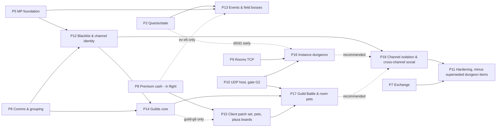

# WindSlayer EN 2009 Server: Roadmap Addendum for the 2009-only Systems (P12-P18)

Lead-architect consolidation of the five 2009 system specs in `re_tools/docs/systems_2009/`:
- `guild.md`
- `pet.md`
- `blacklist_channels.md`
- `instance_dungeon.md`
- `events_bosses.md`

The result is placed on top of `IMPLEMENTATION_ROADMAP.md` (P0-P11). Date: 2026-09-27.

**Client.** EN Outspark v1.04 Build 14 (2009-01-23), `Desktop\WindSlayer2009`.

**Test rig for every exit criterion.** Two 2009 clients on one machine:
- **A** = `WindSlayer2009\WindSlayer_patched.exe`, account test/test, GM character TestHero, uid 1.
- **B** = `WindSlayer2009\WindSlayer_p2.exe`, account admin/admin, a character called "Bob" here, uid 2.
- Both exes were checked present in this pass.
- Tooling as in the 2008 roadmap §1.10: `wsdev --build 2009 send/sendspec --to`, `wsdev cap`, `wsview shot/state`.
- Discipline per `feedback_experiments`: one change per client restart, and bytes plus results go into `LIVE_TEST_LOG.md`.

**Evidence order** is unchanged from the 2008 roadmap: client binary evidence in a spec > live log > server code > memory > PySlayer.

**Tags.** Every claim is tagged.
- **[V]** VERIFIED. Read in code or data, either by the spec author (the spec section is cited) or in this consolidation (marked "checked here", with the evidence).
- **[I]** INFERRED. A design decision, retail-video evidence or a deduction.

**Conventions.**
- `guild §5 F0` means section 5, flow F0 of `systems_2009/guild.md`. Short names:
  - `guild`, `pet`, `blch` (blacklist_channels), `indun` (instance_dungeon), `evb` (events_bosses);
  - `RM` = `IMPLEMENTATION_ROADMAP.md`.
- Item ids carry a group prefix so the specs' own stage labels cannot collide. The pet spec's blockers "B1..B4" and the events spec's boss stages "B1..B6" share names, so the ids here are:
  - `bl-1..3`, `ch-1..5`
  - `guild-g0..g7`
  - `pet-s1..s8`, `cp-1..3` (the client patch set)
  - `ev-e1..e6`, `boss-b1..b6`
  - `indun-d0..d6`
  - `arch09-*` (new cross-cutting items)
- S2C = server to client, C2S = client to server.

---

## 0. Executive summary

- **Baseline.** The server has P0-P7. P8 (premium cash) is being built by another workflow right now. P9-P11 are the 2008 plan. None of the five 2009 systems has a phase in `RM`. The retail survey (`RETAIL_VIDEO_SURVEY_2026-09-24.md` item 9) flagged this gap.
- **New phases, in dependency order** (full details in section 3):

| Phase | Content | Hard dependencies | Can run in parallel with |
|---|---|---|---|
| **P12** | Blacklist and channel identity | P5, P6 | P8, P9 |
| **P13** | Events and field bosses (ev-e6 waits for P8) | P2-P6 | P8, P9 |
| **P14** | Guilds core (create, membership, ranks, chat, points) | P5, P6, P12 | P8, P9 |
| **P15** | Client patch set, pets, Guild Plaza boards | P8, gate G-CP (P14 for boards) | P9, P10 |
| **P16** | Instance dungeons (d0/d1 can start at any time) | P9 (d2/d3), P10 + G2 (d4/d5) | - |
| **P17** | Guild Battle and room-side pets | P10, P14, P15 | - |
| **P18** | Channel world isolation and cross-channel social | P12 (P16/P17 recommended first) | - |

  P11 (hardening) moves after P18, minus its two dungeon items, which P16 supersedes (section 1.2).
- **Carry-ins for the P8 workflow now** (section 2): pet records need limit_type 3, but `cash.py` today yields 0/1/2 only [V, checked here]; the KR→EN +4 item-id shift; the rename hook; shared opcodes 0x73/0x48/0x72/0x6C/0x6D/0x6F.
- **Largest risks** (section 5):
  - Every dungeon stage and Guild Battle map is a UDP room map (shares gate G2 with P10).
  - Pets and plaza boards need a client data patch and an exe patch.
  - Per-receiver client-state mirroring (0x21 tail, pet NULL writes).
  - A channel change is a disconnect plus a relogin.
  - Coupling to the in-flight P8.

---

## 1. Facts verified during this consolidation

These were checked directly for this addendum. They settle or add cross-spec questions.

1. **Client-local uid counters** [V, checked here in `corpus_2009/decomp` + `asm/00451960`]
   - `FUN_00445970` (town NPCs) resets `gs+0x3FC = 33000000` (decomp line 21) and increments it per built entity. It is called only at 0x45336D (S2C 0x03) and 0x455613 (S2C 0x08).
   - The pet-sprite builder `FUN_00447f40` takes its uid from `gs+0x3FC` (decomp :95) and increments it (:162).
   - The dungeon stage builder `FUN_00423970` uses a **local** counter starting at 33000000 (:24). It is called at 0x455E05 (S2C 0x2F) and 0x45D7EE (S2C 0xA5).
   - Neither of the last two call sites resets `gs+0x3FC`.
   - Consequence [I]: on a dungeon stage, a pet sprite (local or remote) can get the same uid as a hidden stage monster. Neither `pet.md` nor `instance_dungeon.md` notes this (conflict X1, gate G-UID).
2. **Being in a party blocks room entry** [V, checked here]
   - `FUN_00445c00` (the room create/join gate, also called by the Guild Battle register `FUN_00485cb0`) walks the open windows for id 0x75. If that window exists and its state `+0x3C != 1`, it refuses with message box 0x16.
   - Decoded `windslayer.hui` window 117 = UILngKo 879 "Party#Window".
   - So a player whose party frame is showing cannot create or join an arena, play, dungeon or Guild Battle room [I: frame shown only while in a party, per the 2008 party spec].
   - Neither the dungeon nor the guild spec draws this conclusion (X13).
3. **Protocol changes that affect `RM`** [V, checked here in `protocol_spec_2009.json`]
   - C2S 0x2D was repurposed: 2008 empty arena-list close became 2009 `u8 0, u32 uid` InstanceDungeonRoomKick. List closing moved to C2S 0x2C {0}.
   - C2S 0x74, 0x75 and 0x7C do not exist in 2009.
   - S2C 0x08 is 7 bytes with a leading `u8 reason`. It replaces the 2008 popup opcodes 0x5E/0xA3/0xA4 (reasons 1/3/4) and adds reason 2 "You were kicked out.".
   - The UDP snapshot header is re-packed: 10-bit timer, 8-bit count.
4. **2009-only opcodes that none of the five specs owns** [V, checked here in the spec list]
   - C2S 0x80 CashItemSaleOffer and 0x81 CashItemSaleReply.
   - S2C 0xA9 CashItemSaleOffer, 0xAA CashItemSaleCompleted and 0xC4 CashItemQuantityPurchaseResult (all marked premium_cash, NEW).
   - C2S 0x9E / S2C 0xC5 X-Trap (stubbed by the 2009 exe patch, per memory).
   - S2C 0xC3 RoomTeamUpdateBatch (pvp).
   - The first five are handed to P8 (carry-in C8).
5. **P8 cash record kind** [V, checked here in `server/cash.py:172-175`, read-only]
   - `CashDef.kind` returns Cash_T only when it is 1 or 2, and 0 otherwise.
   - Pets have hii Cash_T 0 (pet §2.1), but their wire limit_type must be 3 (pet §3, §2.3).
   - As written, P8 would send pets as permanent records, and the 0x6F kind-3 bind would never fire (X6).
6. **0x80 window allowlist** [V, checked here, read-only]
   - `GameServer.PASSWORD_WINDOWS = {0x1A7 bank, 0x1F9 gift, 0x235 delete confirm}` (`windslayer_server.py:9497`).
   - `RM` §4.2 says never to inject 0x80 with a non-allowlisted id.
   - Events ev-e4 needs 0x80 {1, 0x3FB} (X2).

### 1.2 What the 2009 specs supersede or change in `RM`

| `RM` item or rule | 2009 status | Evidence |
|---|---|---|
| P11 `world-instance-dungeon`, `quest_cards_misc-dungeon-exit-0x7C` | **Superseded by P16.** C2S 0x7C does not exist. The dungeon exit is C2S 0x1D {4}. | [V] section 1 item 3; indun §3.8 |
| F2 "Never reply to 0x2D / 0x75 list-close" | In 2009, never reply to **C2S 0x2C {0}**. C2S 0x2D is the dungeon kick (indun-d2). | [V] section 1 item 3 |
| F6 MapTransfer lead ∈ {0x08, 0x5E, 0xA3, 0xA4} | 2009 has a single lead, S2C 0x08 `{u8 reason, u16 map, u32 t}` (7 B). Kick is reason 2. | [V] spec 0x08 `needs_update`; indun §3.15 |
| P9 `pvp-arena-client-exe` (restore the room SendTo) | **Not needed for 2009.** `patch_2009.py` does not NOP the room SendTo at FUN_00424500. | [V] indun §0.2 |
| P9 room pool 1..128 | 2009 allows room numbers **1..196** (C2S 0x1B range). | [V] indun §5 |
| F11 UDP host framing | 2009 header uses a 10-bit timer that wraps at 1023 s. That breaks the 20-minute dungeon timers. | [V] indun §3.16 |
| `RM` §6 Q9 "instance dungeon request opcode unknown" | Answered. The dungeon uses the room opcodes (C2S 0x2C {5}, 0x18, 0x1A-0x1C, 0x1D, 0x2D, 0x95). | [V] indun §0.1 |

---

## 2. Carry-ins for the P8 workflow (not a new phase)

P8 is in flight. The items below touch its data model or its opcodes. They should be absorbed now, or explicitly deferred with a TODO, so that P15 and P13 do not have to reopen P8.

| # | Carry-in | Source | Why now |
|---|---|---|---|
| C1 | Pet records (item Type 6, Kind 14) use **limit_type 3** on the wire, with the pet fields `exp, awake, level, gauge, name[15]` in the 28-byte record (0x6A/0x6F). `CashDef.kind` must special-case Type 6. | pet §2.1, §3 "Pet record in cash lists" [V/S]; section 1 item 5 [V] | Otherwise every pet P8 sells or grants is a dead record. |
| C2 | Every 0x6F must contain the equipped pet record while the character's grid slot 15 is non-zero. 0x6F frees the record that local `+0x1628` points to. | pet §7 H5 [V free; I crash] | P8's `_send_owned_cash` runs on every map load. |
| C3 | **KR→EN item id shift.** EN 2009 hii inserts 4 event items at 4249..4252, so for ids > 4248, EN id = KR id + 4. Any P8 data taken from KR `gamedef.sqlite3` above 4248 (prices, Cash_Cls 17-19 pet tabs, gift certificates) must be shifted, or taken from the EN hii. | pet §1 B2 + `_work/pet/align_kr_en.txt` [V]; evb A1 event items 4249-4252 [V] | Silent wrong-item sales. |
| C4 | A **rename hook** (`premium_cash-rename`) that other groups subscribe to. Guild updates members, master and applications and sends 0xB3 sub 22. Blacklist entries follow the renamed character (X21). | guild §7 [V handler, I trigger]; blch A.8 | Otherwise a rename breaks guild lists or escapes blacklists. |
| C5 | S2C 0x73 NameChangeResult is also the planned refusal for C2S 0x4D PetRename, `{0}`, 1 B. Keep the builder generic. | pet F9 [I] | Shared opcode. |
| C6 | The C2S 0x48 use-cash-item dispatcher must route EN pet food (4286-4289) and the pet name ticket (4322) on an **unpatched** exe: answer 0x72 and then call the pet hook. | pet §1 B2, F5 [V send path; I flow] | These reach 0x48 before CP-2 exists. |
| C7 | An internal API "grant a cash-box record with origin 3" (S2C 0x6C, mileage unchanged). | evb A5 G2, E6 [V] | Needed by ev-e6. |
| C8 | Ownership of the 2009-only cash opcodes C2S 0x80/0x81 and S2C 0xA9/0xAA/0xC4. No system spec covers them. | section 1 item 4 [V] | Avoid an unowned must-reply gap. Check whether any of them opens a wait box before shipping the mall. |

---

## 3. Phases

### 3.0 New cross-cutting items (`arch09-*`)

Each item has one owner phase. Later phases extend it and must not fork it.

| Id | What | Merges | Owner phase |
|---|---|---|---|
| `arch09-resync-bundle` | One ordered post-0x03 resync. The client resets messenger/guild/blacklist/board state inside every 0x03 and then sends 0x2F, 0x63, 0x8A in that order [V guild §1.1, blch A.1]. Required order: own 0x07 → 0x28/0x44 → 0x6F (with the equipped pet) → the replies to C2S 0x2F (0x0B [+0x7E] [+0x78] **+ 0xBD**), C2S 0x63 (card deck 0x8A + 0x59 + 0x99 sub 8 + optional Event News popup) and C2S 0x8A (guild sub 3/15 + sub 4 + 0xBB in 9702 + sub 37). | blch F-B1, guild F0, pet F3, evb E4, blch B.4 | P12 |
| `arch09-session-continuity` | Detect a **channel hop**: a relogin with the same session key within N seconds of the old socket closing. Then: suppress once-per-login effects (welcome, login gift, Event News popup); do not broadcast logout/login; do not credit pending guild points yet (guild sub 21/20). Still send the new channel notice and presence with the new channel. | blch B.5 R2-R3, guild F0/F12, evb E3/E4 | P12 |
| `arch09-channel-key` | Design rule from P12 on: every new per-map, per-room or per-ledger structure is keyed `(channel, …)` even while only one channel exists. Examples: the boss ledger, dungeon rooms, plaza boards, Guild Battle rooms. | blch B.7, evb C | P12 (rule), P18 (enforcement) |
| `arch09-exp-pipeline` | One EXP grant path for kills, quests, dungeon party share and mentor, in this order: card bonus → event multiplier → S2C 0x21 with the conditional `u32 guild_points` tail, which is present exactly when the receiver's client-side guild id is > 1. Guild points are computed from the **pre-multiplier** EXP by default [I, config]. 0x7F never has the tail. | guild §3 0x21 + F12, evb A6/E2, indun F8 | P13 (skeleton), P14 (guild tail) |
| `arch09-receiver-mirror` | A per-session "client view" of receiver-gated state, reset on the receiver's map load. It holds `client_guild_id` (the 0x21 tail, GM = 1), `pet_info_seen: set(uid)` and whether the receiver has had its first 0x03. Every builder with a receiver-dependent shape reads it. | guild §3 + §8.4, pet §4 + §7 H1-H3, blch A.1 (SubHandler3 gate) | P14 |
| `arch09-roster-record` | One player-record builder for 0x04/0x05/0x07/0x52 and the room rosters 0x2B/0x2C/0x2E. It carries the GM-or-guild block (`u16 gm_or_guild_id`, then `bool gm_hidden` when it is 1, or `str[17] + u16 + u16` when > 1; the rosters have no gm_hidden) and the per-receiver pet block. | guild §8, pet §3 "Pet block", indun §3.7 (team = 1), P9 roster items | P14 (field records), P16/P17 (rosters) |
| `arch09-window-open` | A dedicated builder that opens a client window through S2C 0x80 `{1, id}`, separate from the password gate. Its allowlist is {0x3FB}. The password allowlist stays {0x1A7, 0x1F9, 0x235}. Never send 0x1F9/0x1FA/0x4B8/0x4CF through it. | evb A4/A8, `RM` §4.2 | P13 |
| `arch09-id-shift` | Content-loader rule: the EN hii is authoritative for ids; KR-derived rows > 4248 are shifted +4. Exe constants are fixed only by `cp-2`. | pet §1 B2, guild §1.6 | P15 (P8 applies C3 early) |
| `arch09-client-patch-set` | `cp-1` hii CardNpc data patch, `cp-2` exe +4 id-shift patch (17 immediates), `cp-3` Pet Bell source. Behind decision gate **G-CP**. | pet §1 B1/B2/B4 + §9 stage 0, guild §1.6 + §12 Q1 + G6 | P15 |

### 3.1 Phase graph

**Parallel tracks after P7:**
- (a) P12 → P14, alongside P8;
- (b) P13;
- (c) P8 → P15;
- (d) P9 → P10 → P16/P17;
- then P18 → P11.

**Decision gates** (the 2008 gates G1-G3 stay as they are):

| Gate | Phase | Question | Default if undecided |
|---|---|---|---|
| **G-CP** | P15 entry | Does the user approve and install the client patch set (`cp-1` hii, `cp-2` exe)? It must be installed by the user; RE workflows never write into `WindSlayer2009`. | Pets ship server-side but are invisible (pet T0 behaviour). Plaza boards are GM-seeded only. |
| **G-ID1** | P16 d1 | Does a server-spawned 0x1A of entrance template 186/196/203 (`UI: 1220`) open window 0x4C4? | GM/chat path into the dungeon list (indun §9 D1 fallback) |
| **G2** (shared) | P10 / P16 d4 | Faithful UDP room host, or a mode-1 local-simulation exe patch? | Blocks indun-d4/d5 and guild-g7 |
| **G-UID** | P16 d3 | Does a pet sprite collide with the 33000000+n stage monster uids (X1)? Mitigation: an exe patch that moves one counter, or no pet sprites in dungeons. | Pets disallowed from dungeon rooms (refuse 0x18/0x1A-0x1C with an equipped pet, `0x34 {2,5}`) [I] |
| **G-BOARD** | P15 guild-g6 | T-BOARD-ITEM: does any stock EN item reach the billboard dialog? | GM-seeded boards |
| **G-GB** | P17 | Which packet closes the 0x9C waiting box on success (guild §12 Q12)? | sub 34 {0} silent close, then 0x2F |
| **G-CHP** | P12 ch-4 | Does a party survive a channel change (blch E-B2)? | Leave the party on disconnect (current behaviour) |

---

### P12: Blacklist and channel identity (two clients; parallel with P8)

**Goal.**
- A persistent 10-entry blacklist that survives map loads, with a server-side mirror of the client filter that never leaves phantom pending requests.
- Channel identity from the listener, including in-game Change Channel and Change Avatar, and the per-channel inspection flag.
- The two cross-cutting items every later 2009 phase relies on: the resync bundle and session continuity.

Multi-channel stays **dev-only** until P18. Without isolation, two channels still share one world.

**Items:**

| Id | Title | Spec section | depends_on |
|---|---|---|---|
| arch09-resync-bundle | Ordered post-0x03 resync (section 3.0) | blch A.1, guild F0, pet F3 | P6 social_friend-friend-list-sync, P2 world-maptransfer |
| bl-1 | Blacklist store `char['blacklist']` (≤ 10, uid ≠ 0) + S2C 0xBD after every C2S 0x2F | blch C BL-1, A.3, A.4, A.7 F-B1, A.8 | arch09-resync-bundle, P6 social_friend-persistence |
| bl-2 | C2S 0x93 → 0xBE, C2S 0x94 → 0xBF (idempotent remove by name) | blch C BL-2, A.7 F-B2/F-B3 | bl-1 |
| bl-3 | `blocks()` + `BLACKLIST_FILTER` (client / silent (default) / refuse) wired into `refuses()`: whisper, 0x16 fan-out, trade, party, friend, chat invite, mentor, `/f`. No pending state for blocked requests. | blch C BL-3, A.6, A.7 F-B4/F-B5 | bl-2, P5 chat_mail_gm-privacy-flags, P7 trade-request-accept, P6 party-invite |
| ch-1 | One listener per channel in one process; `session['channel']`; 0x01 per-channel port, own user count and inspection (omitted entry); 0x03 `channel_id` and 0x99 sub 8 from the listener | blch B.1-B.4, B.8, C CH-1 | P1 lc-version-config |
| ch-4 | Channel-change robustness: rules R1-R8, relogin across listeners, save before accepting the relogin's 0x2B, answer 0x03 within 5.5 s, decide G-CHP, handle the stale gs+0x408 flag | blch B.5, C CH-4, E-B2/E-B5 | ch-1 |
| arch09-session-continuity | Channel-hop detection (section 3.0) | blch B.5 R2/R3 | ch-4 |
| ch-5 | Operations: 0x02 result 6 when a channel is full, `LOAD_SCALE`, admin open/close of a channel (inspection) | blch C CH-5, B.2 | ch-1 |
| arch09-channel-key | The keying rule (enforced by review from here on) | blch B.7 | ch-1 |

**Order:** arch09-resync-bundle → bl-1 → bl-2 → bl-3 ‖ ch-1 → ch-4 → arch09-session-continuity → ch-5.

**Exit criteria** (A and B as in the header; channels 1-3 on 127.0.0.1 ports 7022-7024, channel 4 configured but closed):
1. A opens Community → Blacklist tab: "(0/10)". A adds "Bob": a row appears, "(1/10)". The row survives a portal and a relog (blch T-B1, T-B2, T-B10). `accounts.json` shows `TestHero.blacklist = [{Bob, 2}]`, and no entry has uid 0 (unit test).
2. B whispers A and map-chats next to A. A shows no line and no bubble. B sees its normal whisper echo (`silent`). With `BLACKLIST_FILTER=refuse`, B sees "TestHero is rejecting whispers." (T-B3, T-B4).
3. B right-clicks A → Trade. A gets no window. A removes Bob and B requests again **within 30 s**: A gets the trade window, which proves no phantom pending request (T-B5 adapted to two clients).
4. A adds "Nobody", then forges a duplicate "Bob" 0x93. Each gets "Wrong user name.\r\nPlease, check again." and the list keeps one Bob row. A deletes Bob, and B's next whisper arrives (T-B11, T-B12).
5. Server select shows "Channel - 1/2/3" with a green "Idle" label and "Channel - 4 (inspection)" with no label. OK on channel 4 gives "Select a available channel to enter." (T-C1). A enters channel 1: both minimaps read "Cecilia(channel-1)" and the chat says "In channel 1." B enters channel 2 in the same way (T-C2, T-C3).
6. A: System Settings → Change Channel → 2 → OK. A is in world on channel 2 at the same map and position, with no character select and no 0x02 result 4 (T-C4). Repeated 10 times quickly, with no hang. B is A's friend and sees at most a channel change in presence, **no** logged-out/logged-in pair (session continuity).
7. A: Change Avatar → character select on the same channel with no OK click (T-C5).
8. An admin closes channel 3. On the next version fetch it shows "(inspection)" and cannot be selected (ch-5).

**Risks:**
- A channel whose port is advertised but dead leaves an undismissable "Waiting..." box (R8). Advertise only listeners that are up.
- gs+0x408 stays set after a change and may skip character select on a later reconnect (E-B5).
- Blacklist ids are account uids, so the id-matched paths also block the target's other characters (E-A3).
- The mentor quirk: the client refuses every blacklist add while the player has a mentor.

---

### P13: Events and field bosses (two clients; parallel with P8; ev-e6 after P8)

**Goal.** Build everything that Build 14 can show for events from existing opcodes:
- scheduled `[Announcement]` notices;
- a server-side EXP multiplier;
- a once-only login gift;
- the Event News popup;
- event quests pushed with S2C 0x26 and handed in at Nicolas.

Add a persistent boss ledger with `value_num` timers, per-entry drop rolls, boss attack A/B/dash and boss quest progress.

**Items:**

| Id | Title | Spec section | depends_on |
|---|---|---|---|
| ev-e1 | `events.py` schedule (UTC), 0x15 msg_type 2 "[Announcement]" on entry and every N minutes (≤ 88 B) | evb E1, A6, A8 0x15 | P6 chat_mail_gm-system-notices |
| arch09-exp-pipeline | Single EXP path (section 3.0), skeleton without the guild tail | evb A6/E2, guild F12 | P3 lc-exp-persist |
| ev-e2 | EXP multiplier after the card bonus, minimum 1; optional quest EXP scaling | evb E2, A6 | arch09-exp-pipeline |
| ev-e3 | Login gift through 0x99 sub 9 (Types 0/1/2 only), claim persisted per character and event | evb E3, A5 G1 | ev-e1, arch09-session-continuity |
| arch09-window-open | 0x80 window-open builder with allowlist {0x3FB} | evb A4/A8 | - |
| ev-e4 | Event News popup `80 01 FB 03 00 00`, once per session and event, after the C2S 0x63 reply | evb E4, A4 | arch09-window-open, arch09-resync-bundle |
| ev-e5 | Push event quests (default 158-160, fully English), Nicolas turn-in 0x17 → 0x27 + 0x21, push the next quest | evb E5, A3 | P2 quest_cards_misc-accept-rework, -turnin-0x17 |
| boss-b1 | Boss ledger `(channel, map, tile)` with `value_num * BOSS_RESPAWN_SCALE` s, persisted, surviving map discard and restart | evb B1, B5, C | P5 world-shared-monsters, arch09-channel-key |
| boss-b2 | Per-entry drop rolls `rate / 100000`, `DROP_MODE` switch, trophies owned by the killer | evb B2, B6 | P4 item_inventory-ground-loot-pickup |
| boss-b3 | Boss combat: attack A/B/dash from AI[0]/[8]/[3], Weak/Strong damage per event | evb B3, B4, B10 | mobai (P11 world-monster-ai-1b, partly present) |
| boss-b4 | Boss quests: kill progress 0x59 for 181/182/184/165/205/215; trophies through the Demand path | evb B4, B7 | P2 quest_cards_misc-kill-progress |
| boss-b5 (optional, default off) | Boss spawn/defeat announcements. Not retail-verified. | evb B5 | ev-e1 |
| boss-b6 (optional, default off) | Pack assist. Not retail-verified. | evb B6 | boss-b3 |
| ev-e6 (deferred) | Cash-side events: 0x6C origin 3; mileage 0x70 + 0x98 | evb E6, A5 G2, A7 | P8 (carry-in C7) |

**Order:** ev-e1 → arch09-exp-pipeline → ev-e2 → ev-e3 → arch09-window-open → ev-e4 → ev-e5 ‖ boss-b1 → boss-b2 → boss-b3 → boss-b4 → (b5, b6 optional). ev-e6 lands with P8.

**Exit criteria:**
1. **Baseline, no event** (evb T-E0). A clicks Eventina in Popola (201, about 1800,1494): "Event News" opens with the close-beta art, and the server log shows **no** C2S.
2. **Event window active** (exp_mult 2, login_gift 1282×5, popup on, push 158). A and B log in. Each sees, exactly once:
   - the centre notice with a teal "[Announcement] ..." line;
   - the Event News popup (no "Invalid password" box);
   - "You've received Love Potion. (Count:5)";
   - "*Monster Card Challenge" in the quest log.

   A relog, a portal and a channel hop (P12) repeat **none** of them (T-E1, T-E3, T-E4).
3. A kills a Ssiyo: "You've received (+20) experience points." After the event ends: +10 (T-E2).
4. A holds 20 Blue Mushrooms and clicks Nicolas: C2S 0x17 158 → "[*Monster Card Challenge] Quest Completed.", Card <Koring>, EXP and gold. Quest 159 is pushed next. B without mushrooms clicks Nicolas: nothing (T-E5).
5. Both enter Foothill 218. There is one Rynx near (1609,1835) with the same uid on both clients (T-B1). A kills it:
   - both see the death and, about 3 s later, the corpse removal;
   - item 124 drops and only A can pick it up (B gets "You don't have ownership of this item.");
   - Rynx stays absent for 300 s, even when B leaves and returns at 200 s and after a server restart at 250 s;
   - it reappears at 300 s on both clients (T-B2).
6. A (Lv 15+) aggroes the Monkey King at Ascetic Quarter 409. Both clients see attack A, attack B and dash. A's C2S 0x0D carries events 7 and 9 with the King as source. Monkey Lord on 406 swings attack A only (T-B3).
7. Quest 64 from Mei: kill the King, pick up 1291 and turn in: Yellow Stripe Hat and +100 EXP. A Lv 30 Rogue holding quest 182 gets 0x59 progress 1 from the kill (T-B4).

**Risks:**
- `value_num` = respawn seconds and the /100000 drop unit are both [I]. Put them behind config.
- The 0x2A boss attack commands are not live-verified.
- The Korean-text event quests (232-291) would render as CP949 bytes. Default: push 158-160 only.
- The 0x80 popup must not use the password path (X2).
- EXP×2 against guild points (X9): the guild half of the test is in P14.

---

### P14: Guilds core (two clients; after P12; parallel with P8)

**Goal.**
- Guild storage and display: tags, the Community Guild tab, the welcome line on every map load, and guild points in 0x21.
- Create and disband at Moiba (9702).
- Membership (apply, accept, leave, kick) with login/logout lines.
- Ranks, master change, notice and capacity.
- Guild chat.

Includes the 0x96/0x9C soft-lock fallbacks.

**Items:**

| Id | Title | Spec section | depends_on |
|---|---|---|---|
| guild-g0 | Spec/codec fixes: swap the job1/job2 names in sub 3/13, set 0x88 to 87 B, builders for 0xB3 subs and 0xB4-0xBB, a guard that forbids S2C 0xB9 and sub 19 as a reply | guild §11 G0, §1.1, §3 | P0 lc-codec |
| arch09-receiver-mirror | `client_guild_id`, `pet_info_seen`, first-0x03 flag (section 3.0) | guild §3 + §8, pet §7 | P5 world-registry |
| arch09-roster-record | Field records 0x04/0x05/0x07/0x52 with the GM/guild block | guild §8 | P1 world-player-record |
| guild-g1 | Guild store, 0x8A → sub 3 (+ sub 4 for masters) or sub 15 (+ sub 37 for a GM), guild block in records, 0x21 tail, **0x96 → sub 23 {0} / 0x9C → sub 34 {0} fallbacks**, admin seeding | guild §11 G1, F0, F14, §7, §8 | guild-g0, arch09-receiver-mirror, arch09-roster-record, arch09-resync-bundle, ch-1 (member `online` byte = channel [I]) |
| guild-g2 | Create 0x87 → sub 1 + sub 3 (n = 0) + 0xB4; disband 0x8E(3) → sub 8 + 0xB7 (+ 0xB8) | guild G2, F1, F6 | guild-g1 |
| guild-g3 | Apply 0x89 (4 B or 2 B) → sub 2 (+ 0x10 push / 0x11); FIFO applications; 0x8B/0x8C → sub 5/13/3; leave/kick → sub 6/14/18 + 0xB7; login/logout sub 20/21 | guild G3, F2-F5 | guild-g2, arch09-session-continuity |
| guild-g5 | Chat 0x8D → 0xB5 to **other** online members on any channel (name rebuilt, ≤ 87 B, 700 ms); guild points in the 0x21 tail + logout credit sub 21 | guild G5, F11, F12 | guild-g3, arch09-exp-pipeline |
| guild-g4 | Grades 0x92 → sub 16/17 (4 Guardians / 10 Vanguards), master change 0x91 → sub 11/12 (old master becomes grade 1), notice 0x8F → sub 7, capacity 0x90 → sub 9/10 with server-side tier/level/gold checks, rename hook → sub 22 | guild G4, F7-F10, §7 | guild-g3; soft: P8 premium_cash-rename (C4) |

**Order** (the spec's order): g0 → g1 → g2 → g3 → g5 → g4. Keep Moiba's 0x0B billboard sale refused ("Guilds are not available.") until P15 (X8).

**Exit criteria.** Setup:
- A = TestHero, Lv ≥ 30, job2 ≠ 0, ≥ 60,000 gold, with the **GM tag hidden or off** during these tests. A visible GM has entity+0x12 == 1, and the client then refuses to create or apply with "Wind master can't register as guild." [V guild §1.2].
- B = Bob, no guild.
- Both on 9702 Guild Plaza, entered from 801, 1001 or 1101.

1. **g1 with a seeded guild "Testers"** (A Master, B Trainee):
   - both see the other's yellow "Testers" tag and emblem;
   - Community → Guild shows "Testers   Lv.1" and "(2/15)";
   - each portal prints "[Guild Master]:Hello. Welcome to Testers guild." once, with no duplicated members after 5 portals;
   - B kills 20 mobs: every kill prints "(+N) guild points are gained." with no stream desync;
   - with the P13 EXP×2 event on, the tail is still present and the points follow the pre-multiplier rule.
2. A (grade 5, with fake online members seeded so the client-side "≥ 6 online" gate passes) presses Guild Battle. The "Waiting for the server to respond." box closes within 1 s (F14 fallback).
3. After disbanding the seed: A → Moiba → Guild make → "Testers" + emblem → Regist → Create.
   - A sees "Guild has been registered." and gold drops by exactly 50,000 on the client and in the store.
   - B sees the tag appear through 0xB4.
   - A relogs and is still in the guild (guild 10.2 step 1).
4. B right-clicks A → the join entry → OK: "You have applied for this guild.", and A's HUD notification icon appears. A accepts: "Guild admission has completed.", "(2/15)". B gets the welcome line and the tag, and each sees the other's tag (steps 2-3).
5. B types `/g hi`. A sees the yellow line "Bob : hi" once, and B sees only its local echo. With B moved to channel 2 (P12 dev channels), the line still arrives (step 4).
6. B logs out: A sees "[Bob] has logged out." + "Guild point(+N : [Bob]) increased.". B logs in: "[Bob] has logged in.". B's channel hop produces **none** of these lines (step 5 + session continuity).
7. Grades: A sets B to Guardian. A gets the result box and both lists show "Guardian". Notice: after a portal both get "[Guild Master]:<notice>". Capacity with points seeded to Lv 2: "You can add max No. of guild by 5.", cost 6,500, gold −6,500 on both sides, "(2/20)" (steps 6-8).
8. Master change A → B. The lists swap, and A becomes Trainee with the "Leave" caption. B kicks A: A gets "You are out of this guild." and loses the tag. B alone → Break Guild: "Your guild has been deleted.", and the tags are gone on both clients (steps 9-12).
9. Negative cases:
   - a duplicate name gives "You can't use this guild name.";
   - applying to a full guild gives "This guild can't recruit any more members.";
   - A below Lv 30 gets "Cause: (Level)" client-side, and no packet leaves (step 13).

**Risks:**
- Guild state crashes and desyncs:
  - the 0x21 tail must mirror `client_guild_id` exactly;
  - a second sub 3 without a 0x03 duplicates every member;
  - subs 1/3/6/8/15 before the own 0x07 hit a NULL entity.
- Unknown retail rules: the GP formula (one sample), the 1-day leave and 7-day disband rules, who may change grades. Put them in config.
- A GM who is also a guild member can show only one tag.
- Character deletion versus membership and mastership is not specified (open question O7).

---

### P15: Client patch set, pets and Guild Plaza boards (after P8; gate G-CP; boards after P14)

**Goal.** Make pets real end to end: records, visibility, equip, the hunger/EXP tick, emotes, sleep and wake, feeding, the bell, pet gear, rename and the mall bind. Give the KR-numbered exe constants a single fix that serves both pets and plaza boards.

**Items:**

| Id | Title | Spec section | depends_on |
|---|---|---|---|
| cp-1 (pet 0a) | hii CardNpc = 182..185 on the 20 pet and pet-gear rows, re-sealed (candidate `_work/pet/windslayer_2009_petfix.hii`) | pet §1 B1, §9 stage 0 | **G-CP** |
| cp-2 (pet 0b + guild §12 Q1) | Exe patch in `patch_2009.py`: +4 on 11 pet immediates (bell, foods, ticket) and 6 guild billboard immediates | pet §1 B2 table, guild §1.6 | **G-CP** |
| cp-3 (pet 0c) | Pet Bell source: hni grocer patch, loot, or GM/quest grant | pet §1 B4 | G-CP |
| arch09-id-shift | Loader rule (section 3.0) | pet §1 B2 | P2 arch-content-loader, P8 (C3) |
| pet-s1 | Pet fields on kind-3 records (C1), grid 15/23/24 + look_ext in records, per-receiver has_pet block, `pet_info_seen`, GM `!pet give/set` | pet §9 stage 1, §3, F3, §6, §7 | P8 premium_cash-owned-list-sync (C1, C2), arch09-receiver-mirror, arch09-roster-record |
| pet-s2 | 0x82 → 0xAB (6 B local form / 21 B remote form), 0x83 → 0xAC only to viewers in `pet_info_seen`, gear-slot gate | pet stage 2, F1, F2 | pet-s1 |
| pet-s3 | Tick (field maps only): 0xAE / 0xAF / 0xAD(0); 0x86 → 0xB2 to owner + viewers | pet stage 3, F4, F6, F8 | pet-s2, P0 arch-tick-scheduler |
| pet-s4 | Feed 0x85 → 0xB1 (+ 0xAD 1); bell 0x15 → 0x25 + 0xAD; unpatched fallback 0x48 → 0x72 + 0xB1 | pet stage 4, F5, F7 | pet-s3, P8 premium_cash-use-generic (C6) |
| pet-s5 | Pet gear Kind 15/16 through 0x0F/0x11 with the species check | pet stage 5, F10 | pet-s2, P2 item_inventory-equip |
| pet-s6 | Rename 0x4D → 0xC0 + 0xB0 (awake only); refusal 0x73 {0} | pet stage 6, F9 | pet-s3, cp-2, P8 premium_cash-rename (C5) |
| pet-s7 | Mall: sell pets, gear, food and tickets; box records at level 0; bind on move to the bag (F13) | pet stage 7, F13 | P8 premium_cash-buy, -mall-exit |
| guild-g6 | Plaza boards: 0xBB after the 0x8A reply in 9702, expiry → 0xB8, 0x88 → 0xBA + sub 185, Moiba sale via 0x0B | guild G6, F13 | guild-g2, cp-2 or GM-seeded boards, **G-BOARD** |

**Order:** G-CP → cp-1/cp-2/cp-3 → pet-s1 → s2 → s3 → s4 → s5 → s6 → s7 ‖ guild-g6 after G-BOARD.

**Exit criteria:**
1. G-CP is recorded in LIVE_TEST_LOG.
   - Unpatched hii: a GM-granted Picky moves into the Pet slot and "Pet info." opens, but **no sprite** appears (pet T0).
   - Patched hii and exe installed by the user: a baby bird named "Picky" follows A, jumps ledges, drops down and warps back past 600 px. B sees the same pet (T1).
2. B enters the map after A's pet is out and sees it on arrival (T2). A portals and relogs, and the pet comes back (T17). A logs out, and A and the pet vanish on B (T18).
3. "/Pet smile" plays on both clients. "/Pet warning" at level 1 prints "Insufficient pet level." and sends no packet (T4, T5).
4. The gauge falls to 10%: the bubble shows, auto C2S 0x85 fires, 0xB1 sets 90% and the bubble "I feel new power." shows (T6). With no food the pet falls asleep on both clients and the Pet slot greys out (T7). The Pet Bell wakes it: the bell is consumed and the pet reappears on both (T8). The bell at a 5% gauge prints "Pet has to have at least over 10% HP to wake up." (T9, patched exe).
5. Red Hood on Picky shows on both clients (T10). Ulie gear on Picky prints "This is not the equipment of your pet." (T11). Unequipping Picky with the hood on prints "Take off the equipment of your pet first." (T12). With the hood off, unequip removes the pet on both clients and **B does not crash** (T13).
6. Auto-loot picks up consumables within about 25 px of the pet, and equipment only at pet level ≥ 5 (T14).
7. Rename to "Tweety": the wait box then "Pet name has been changed.", and the name tag updates on both (T15). A rename while asleep is refused, the box closes and nothing crashes (T16).
8. A 30-minute soak: A cycles equip/unequip/sleep/wake while B enters and leaves the map every 2 minutes. There is no crash on either client (hazards H1, H2, H5).
9. guild-g6 after G-BOARD: A (master) places a board in 9702 and B sees it. B clicks it → the join dialog → C2S 0x89 (u16). The board expires and disappears on both. Re-entering 9702 restores the live boards (0xBB).

**Risks:**
- The client patch has to be distributed and installed by the user (never by a workflow).
- 0x6F dangling pointer (C2); NULL writes in 0xAC/0xAD/0xB0/0xC0.
- The hunger and EXP rates come from dead host code [I].
- The box→character bind semantics are [I].
- The unpatched exe routes food to 0x48.

---

### P16: Instance dungeons (d0/d1 early; d2/d3 after P9; d4/d5 after P10 + G2)

**Goal.** Party dungeons 1-3 as room mode 5 on the shared room machinery:
- the entrance NPC and room list;
- create, join, ready, kick, leave and start;
- the server-driven stage machine (0xA5, 0xA7, 0x36 kind 5);
- the in-stage simulation under G2;
- the script engine.

**Items:**

| Id | Title | Spec section | depends_on |
|---|---|---|---|
| indun-d0 | Content extractor: the three Quest-2 templates, 18 stage files, action-13 uid numbering with the skip rules, portal lines, start and arrival tiles, time limits, reward pool; data fix 304 → 305 | indun §9 D0, §1.1-1.4 | P2 arch-content-loader |
| indun-d1 | Entrance NPCs 186/196/203 spawned with 0x1A (Popola for 186) + **G-ID1** | indun D1, F1, Q1 | indun-d0, P5 world-shared-monsters |
| p9-2009-deltas | P9 changes for 2009: one C2S 0x2C with list_type; room pool 1..196 **global across channels** (X12); 0x08 reason byte; no arena exe; room modes 5 (dungeon) and 7 (Guild Battle) reserved | indun §5, §3.15; section 1.2 | P9 pvp-room-model, pvp-room-lists |
| indun-d2 | DungeonRoom on the shared RoomManager: 0x2C{5} → 0xC2 (+ pushes); 0x18 → 0x34{5,5} + 0x2F(mode 5, dungeon_ref) + 0x2E (team 1); 0x1A/1B/1C → 0x34 codes including 9; 0x1D{1} → 0x35; 0x2D kick → 0x08{2} + 0x2D; 0x1D{4} / disconnect → leave + master handoff; 0x95 validated; C2S 0x15 allowed in dungeon rooms; rosters through arch09-roster-record | indun D2, §3.1-3.10, F2-F6 | p9-2009-deltas, P9 pvp-session-registry, P2 world-maptransfer (2009 0x08), indun-d1, arch09-roster-record |
| indun-d3 | Stage over TCP + a minimal UDP phase driver (opcode 7/8/9 header-only datagrams at 1 Hz); GM `/indun stage|trigger|clear|fail`; 0x36 kind 5 per member + inventory/EXP; return after 10 s; handle the 1023 s wrap | indun D3, §3.11-3.13, §3.16 | indun-d2, P9 arch-udp-inject, arch09-exp-pipeline |
| gate G-UID | Pet/stage-monster uid collision test and mitigation (X1) | this addendum section 1 item 1 | indun-d3, pet-s1 |
| indun-d4 | In-stage simulation: option A = UDP host with monsters; option B = an exe patch so InDun maps run the mode-0 simulation | indun D4, Q2 | **G2** (P10 pvp-mode1-sim-spike) |
| indun-d5 | Script engine: conditions 2/3/5/6, actions 13-17, the all-members-Down portal rule, stage advance, wipe/timeout fail, boss-death clear, party-share EXP, auto return | indun D5, F8-F11 | indun-d3, indun-d4 |
| indun-d6 | Hardening: leavers and reconnects (0x34 {9}), empty-room teardown, cooldown config, GM tools, the 17-minute wrap on 20-minute dungeons, the Condition-5 gap on 0xA5 stages | indun D6, Q7, Q13 | indun-d5 |

**Order:** d0 → d1 (any time after P5) → [P9] → p9-2009-deltas → d2 → d3 → G-UID → [P10 / G2] → d4 → d5 → d6.

**Exit criteria.** Setup:
- A and B Lv ≥ 8;
- **neither in a field party** (client gate X13; leave the party first);
- neither has a pet equipped until G-UID is closed.

1. Offline: `test_indun_content` pins stage 106 Rynx = 33000027, stage 206 Monkey King = 33000022, and the 304 portal → 305.
2. A clicks the server-spawned "Hidden forest" NPC in Popola. The "Dungeon list" window opens, `wsdev cap` shows C2S `2C 05`, and the server answers 0xC2 (G-ID1 recorded).
3. A creates "Gang of forest" (capacity 5, title "Run"). A loads stage 101 with the "Dungeon Party" window " Room1 Run [Gang of forest]".
   - B's list shows "001 Run(01/05) Lv.8". B joins, and both party windows list A (master, first) and B.
   - B presses Ready and A's window shows "Ready". Start sends C2S 0x95, which the server accepts (indun 8.2 step 1).
4. A kicks B (slot-1 button): B gets "You were kicked out." and lands at its saved field position. B rejoins, then Leave Now → returns. The room row count updates in the list of whoever has the list open.
5. d3: after Start, both HUDs switch to 0x47A and the timer counts down from 12:00.
   - `/indun stage 102` moves both clients together, and `wsview state` shows 8 hidden type-4 entities 33000000..33000007.
   - `/indun clear` opens "Rewards Dungeon" with an "Old …" item on each client, and the item survives a relog.
   - `/indun fail` shows "Failed to conquer the instant dungeon." and both return to the field (indun 8.2 step 2).
6. G-UID: with a pet equipped (after P15), enter stages 101 and 102. With the chosen mitigation in place, `wsview state` shows no duplicate uid.
7. d4/d5 (after G2): both players move and see each other.
   - The Statue appears at 3 s and breaks. The portal marker shows 10 s later. Both press Down → stage 102.
   - The run reaches 106, Rynx dies, the reward shows, and both are back in Popola after about 10 s.
   - A wipe shows the failure box and returns both. An idle run fails after 12 minutes (indun 8.2 step 3).

**Risks:**
- G2 is the single largest item. It is shared with P10.
- G-ID1: the entrance NPCs are placed on no map.
- Stages entered with 0xA5 never bind Condition-5 rows (Q7).
- Only party slot 1 has a working kick.
- The seconds field wraps at 17 minutes.
- The party gate (X13) confuses users who expect "party dungeon" to use the field party.
- The pet uid collision (X1).

---

### P17: Guild Battle and room-side pets (after P10, P14, P15)

**Goal.**
- Guild Battle: registration, roster, room list, challenge and accept (0xB3 subs 23-35, C2S 0x96-0x9D).
- Room mode 7 matches through the P9/P10 room host.
- Persistent W/L/D, and a win broadcast (a pre-formatted 0x15, since Build 14 has no format string).
- Pet tails in room rosters, with no pet tick in rooms.

**Items:**

| Id | Title | Spec section | depends_on |
|---|---|---|---|
| guild-g7 | Guild Battle state machine (subs 23-35), mode-7 rooms on maps 9801-9804, sub 35 + W/L/D persistence, "Draw. Guild Battle is closing." via 0x36, win line via 0x15 (msg_type 0 or 2), **G-GB** | guild §9, G7 | P10 pvp-udp-host, pvp-round-scoring, guild-g4, p9-2009-deltas, arch09-roster-record |
| pet-s8 | Pet tails in 0x2B/0x2C/0x2E (0x2C always, 0x2B/0x2E per receiver); pets hidden for spectators; no tick on mode-1 maps | pet stage 8, §3 | P9, pet-s3, arch09-roster-record |

**Exit criteria.** Setup:
- Two guilds: "Testers" (A master) and "Rivals" (B master).
- Each is seeded with fake online members so the client gates pass: grade ≥ 3, ≥ 6 online members, job1 ≠ 0 [V guild §4].
- `GB_ROSTER` debug = 1 so one player per side can start [I: whether the client needs a full roster is unknown].
- Neither A nor B is in a field party (X13).

1. A presses Guild Battle: window 0x4D0 opens with A in the roster. B does the same. A creates a room on 9801 "Popola". B sees it in "Waiting Guilds" and challenges. A, the room leader, gets the challenge prompt `"[%d] %s"` = "[<room_id>] Rivals" (sub 33). A accepts (0x9C). The waiting box closes (G-GB) and both enter the arena map in room mode 7.
2. They fight to a result. Both Guild Info windows update "…Round …Win …Lose …Draw" (sub 35), the values persist after relog, and both clients show the win broadcast line. A draw prints "Draw. Guild Battle is closing.".
3. Leaving registration (0x9B) or disconnecting removes the entry on the other roster (sub 30/31). A stopped registration shows "Guild Battle registration has been stopped.".
4. pet-s8: A's pet is visible to B on the team roster and hidden in spectator state. No pet gauge changes during the match.

**Risks:**
- The whole choreography is [I]: the KR server was never observed.
- Sleep(500) inside the client's network handler for subs 28/29 and after 0x97/0x9A.
- The sub-26 stack hazard (last ≤ 24; use ≤ 5).
- Retail used 6v6, which cannot be reproduced with two clients.
- The 2010 win-broadcast text is a later build.

---

### P18: Channel world isolation and cross-channel social (after P12; before advertising more than one channel)

**Goal.**
- Per-channel world state: map instances, monsters, drops, trades, stalls, party formation, rooms and room lists, the boss ledger and plaza boards.
- Global social layer: whisper, friends, mentor, `/f`, guild, blacklist, memos.
- The channel tags the client already renders.

**Items:**

| Id | Title | Spec section | depends_on |
|---|---|---|---|
| ch-2 | Map instances keyed `(channel, map)`: visibility, movement relay, monsters, spawns and ticks, drops; trade, stall and party formation filtered by channel; room/arena/battlefield/dungeon lists per channel | blch C CH-2, B.7 | ch-1, arch09-channel-key |
| arch09-room-pool | Room numbers unique across all channels, because the client always targets UDP port 10000 + room_no on host_ip (X12) | indun §2.2, `RM` F11 | P9 pvp-room-model, p9-2009-deltas |
| ch-3 | Cross-channel tags: 0x09 status / 0x0A channel ("<To: %s[Channel-N]>"); friend rows and 0x60 status 0 vs 4 with the channel; mentor 100 vs channel; 0x0F subtype 2 for cross-channel chat invites (also the guild "Converse" path); global `/f` relay | blch C CH-3, B.6 | ch-1 |
| ch-2-ledgers | Re-key the boss ledger, plaza boards and dungeon/GB rooms by channel (these should already carry the key) | evb C, guild G6, indun §6 | ch-2 |

**Exit criteria** (A on channel 1, B on channel 2, then the reverse):
1. Both stand on map 101 and do not see each other. A hits a mob; the same spawn has full HP on B's channel. Portals keep each player on its channel (T-C6).
2. A whispers Bob: A sees "<To: Bob[Channel-2]> hi" and B sees "<From: TestHero[Channel-1]> hi". On the same channel there is no tag (T-C7).
3. B logs in on channel 2: A sees "<Bob> has logged in.(Friend, Channel 2)" (T-C8). A "Converse" invite to B gets "<Bob> is in other channel. You can't have a personal chat." (T-C9). Guild chat (P14) and the blacklist (P12) still work across channels.
4. A kills Rynx on channel 1. Rynx is still alive on channel 2 (per-channel ledger).
5. A creates a dungeon room on channel 1 and B creates one on channel 2. They get **different** room numbers, and each list shows only its own channel's room.
6. Inside a dungeon, Change Channel is refused with "You can't do that in the dungeon." and the player stays connected (T-C10).

**Risks:**
- Retrofit breadth: every per-map subsystem from P5-P17 has to be re-keyed. arch09-channel-key keeps this mechanical.
- Party policy across channels (G-CHP).
- The room-number pool (X12).

---

## 4. Cross-spec conflicts and duplicated opcodes

### 4.1 Conflicts (each has a resolution and an owner)

| # | Conflict | Specs | Resolution | Owner |
|---|---|---|---|---|
| X1 | **Client-local uid collision.** Pet sprites take `gs+0x3FC`, which is reset only on 0x03/0x08. Dungeon stage monsters are numbered 33000000+n from a local counter on 0x2F/0xA5. A pet in a dungeon can share a uid with a hidden stage monster [V counters, checked here; I effect]. | pet §2.2 H6, indun §1.4 | Gate G-UID with a live test. Mitigations: an exe patch so one of the two counters starts at a disjoint base, or refuse room entry with an equipped pet. | P16 |
| X2 | **S2C 0x80 allowlist.** `RM` §4.2 and the server's `PASSWORD_WINDOWS` allow {0x1A7, 0x1F9, 0x235}; events want `{1, 0x3FB}` for the Event News popup. | evb A4/A8, `RM` §4.2 | `arch09-window-open`, a separate builder with allowlist {0x3FB}. The password allowlist is unchanged. | P13 |
| X3 | **C2S 0x2D repurposed.** `RM` says never reply to 0x2D (2008 list close). In 2009 it is the dungeon kick; list close is C2S 0x2C {0}. | indun §3.9, `RM` F2 | 2009 route table: 0x2C {0} → no reply; 0x2D → indun-d2 (no reply to the sender; 0x08 {2} to the target, 0x2D to the others). | P16 (registry note now) |
| X4 | **P11 dungeon items are 2008 designs** (C2S 0x7C does not exist in 2009). | `RM` P11, indun | P16 supersedes `world-instance-dungeon` and `quest_cards_misc-dungeon-exit-0x7C`. | P16 |
| X5 | **MapTransfer lead.** `RM` F6 uses 0x08/0x5E/0xA3/0xA4 (2008). 2009 has one 0x08 with a reason byte. Dungeon kick = reason 2; room exits and GB exits use the same primitive. | indun §3.15, `RM` F6 | `world-maptransfer` takes a `reason` parameter for 2009. | P16 (p9-2009-deltas) |
| X6 | **P8 cash kind versus pet limit_type 3.** `cash.py` `CashDef.kind` ∈ {0,1,2}, pets need 3 [V, checked here]. | pet §2.1/§3, P8 | Carry-in C1. | P8 → P15 |
| X7 | **KR→EN +4 id shift** for ids > 4248. It affects the guild billboards (exe 4279/4280 vs EN 4283/4284), the pet bell, foods and ticket, and any KR-derived server data. Both specs propose the same exe patch; the four inserted items are evb's event items 4249-4252. | pet §1 B2, guild §1.6 + §12 Q1, evb A1 | One owner: `cp-2` + `arch09-id-shift`; P8 applies C3 now. | P15 |
| X8 | **Moiba sells EN 4283** (Premium Guild Billboard). On the unpatched exe, 0x10BB falls into the pet-food case of FUN_0046d6f0. | guild §1.6, pet §1 B2 | Keep the 0x0B refusal for Moiba until cp-2 / G-BOARD is decided. | P14 → P15 |
| X9 | **Four new writers of S2C 0x21** (guild points tail, event multiplier, dungeon party share, boss kills), and an open policy: are guild points computed before or after the EXP multiplier? | guild F12, evb E2, indun F8, evb B10 | `arch09-exp-pipeline`, one builder. Guild points come from pre-multiplier EXP by default; the guild-tail test sits in the P14 exit criteria. | P13/P14 |
| X10 | **Room rosters are touched by four specs**: 0x2B/0x2C/0x2E carry the guild block (no gm_hidden) and the per-receiver pet block, and the dungeon requires team = 1. | guild §8.2, pet §3, indun §3.7, P9 | `arch09-roster-record`, one builder owned by P9 and extended by P14/P15. | P9/P14/P16 |
| X11 | **Once-per-login effects versus the channel change** (a disconnect plus a relogin). Guild sub 20/21 lines and the GP credit, the events login gift and popup, and the welcome message all re-fire. | blch B.5 R2, guild F0/F12, evb E3/E4 | `arch09-session-continuity`. | P12 |
| X12 | **"UDP room port base per channel" is impossible.** The client always sends to host_ip:room_no+10000. | blch C CH-2, indun §2.2, `RM` F11 | One global room-number pool (1..196) across channels; the room lists stay per channel. | P18 (P9 builds it global) |
| X13 | **A field party blocks room entry.** FUN_00445c00 refuses while window 0x75 "Party#Window" is open. This applies to dungeon rooms and to Guild Battle registration [V, checked here]. Neither spec lists it as a design constraint. | indun §3.5, guild §9, P6 party | Document it in the test setups. The dungeon roster is separate from the P6 party; do not auto-convert a party into a dungeon room [I]. | P16/P17 |
| X14 | **Rename policy disagreement.** Guild wants renames propagated (sub 22). Blacklist drops renamed entries lazily, so a blocked player escapes by renaming. | guild §7, blch A.8 | A P8 rename hook (C4). Store guild membership and blacklist entries by a stable per-character id; the name is display-only. | P8 → P12/P14 |
| X15 | **S2C 0x36 has three users**: arena rounds (P10), dungeon kind 5 (clear: item added client-side; sending it twice grants twice), and the GB draw text in room mode 7. | indun §3.13, guild §3, `RM` P10 | One builder with kind branches and an exactly-once send per member. | P10/P16/P17 |
| X16 | **Guild member `online` byte = channel number** [I] and 0x03 `channel_id` = listener channel [V]. They agree only after ch-1. | guild §7, blch B.4 | guild-g1 depends on ch-1. | P12 → P14 |
| X17 | **S2C 0x73 has two users**: character rename (P8) and pet rename refusal (pet F9). | pet F9, P8 | Carry-in C5. | P8 |

### 4.2 Opcodes used by more than one system

| Opcode | Dir | Users | Single owner (builder) |
|---|---|---|---|
| 0x21 ExpDelta (+ guild tail) | S2C | guild, events, dungeon, bosses, P3 | arch09-exp-pipeline |
| 0x15 SystemMessage (≤ 88 B, "[Ann" → centre notice) | S2C | events, bosses (optional), Guild Battle win line, P6 welcome/GM | chat_mail_gm-system-notices |
| 0x99 sub 8 / sub 9 | S2C | channels (channel notice), events login gift, `grant_item` | existing `grant_item` / channel notice |
| 0x80 | S2C | password gate (P4/P8), Event News popup | split: password gate + arch09-window-open |
| 0x04 / 0x05 / 0x07 / 0x52 records | S2C | world, guild block, pet block | arch09-roster-record |
| 0x2B / 0x2C / 0x2E / 0x2D / 0x2F / 0x34 / 0x35 / 0xC3 | S2C | P9 arena/play, dungeon (mode 5, dungeon_ref), Guild Battle (mode 7), pets | P9 room model + arch09-roster-record |
| 0x36 | S2C | P10, dungeon kind 5, Guild Battle | X15 |
| 0x08 ChangeMap (reason) | S2C | world, dungeon kick/return, room exits | world-maptransfer |
| 0x1A spawn | S2C | world mobs, bosses, dungeon entrance NPCs (and dungeon option B) | world-shared-monsters |
| 0x03 | S2C | world; its `channel_id`; it also wipes guild, applications, boards and blacklist on the client | world-03-real-state + arch09-resync-bundle |
| 0x6A / 0x6C / 0x6D / 0x6F / 0x70 / 0x72 / 0x73 / 0x98 | S2C | P8, pets (records, food, rename refusal), events (origin 3, gifts, mileage event) | P8 (carry-ins C1-C7) |
| 0x1D / 0x1E | S2C | item equip, pet gear | item_inventory-equip |
| 0x13 / C2S 0x1F | both | ground pickup, pet auto-loot (repeats every tick until 0x13) | ground.py (already idempotent) |
| 0x25 / C2S 0x15 | both | item use, Pet Bell, guild sub 185 → 0x15 {0x10B8}, skill casts inside dungeon rooms | one UseItem route with item hooks |
| 0x26 / 0x27 / 0x59, C2S 0x16 / 0x17 | both | P2 quests, event quest push, boss quests | quest_cards_misc |
| C2S 0x2F | C2S | friend list resync (P6), blacklist 0xBD | arch09-resync-bundle |
| C2S 0x2C / 0x18 / 0x1A / 0x1B / 0x1C / 0x1D | C2S | P9 rooms, dungeon (type 5; 0x1D codes 1/4) | P9 RoomManager, branching on room kind |
| C2S 0x33 | C2S | messenger invite, guild "Converse", blacklist outgoing block, 0x0F subtype 2 across channels | social_friend-chat-room |
| C2S 0x0B | C2S | NPC shop, Moiba billboard purchase | shop_storage-npc-buy (X8) |
| C2S 0x48 → S2C 0x72 | both | P8 use-cash-item, unpatched pet food/ticket | P8 (C6) |
| UDP 3 / 7 / 8 / 9 + HP/MP events | both | P10 arena, dungeon, Guild Battle | pvp-udp-host (G2) |

**Direction-only overlaps.** These are not conflicts, but they matter for any registry keyed by bare opcode. The server keys C2S routes by send-site key (`RM` F1), so it is safe.
- C2S 0x99 GuildBattleRoomCreate vs S2C 0x99 SystemNotice.
- C2S 0x8A GuildInfoRequest vs S2C 0x8A card deck.
- C2S 0x80 CashItemSaleOffer vs S2C 0x80 SecondPasswordResult.
- C2S 0x96/0x97 Guild Battle vs S2C 0x96/0x97 manner.

**Never send:**
- **S2C 0xB9**: there is no handler anywhere [V guild].
- **0xB3 sub 19 as the reply to 0x8A**: the client re-sends 0x8A in an endless loop [V].
- **Blacklist entries with id 0**: they block everyone [V blch A.4].
- **0xAC / 0xAD(0) to a viewer without pet_info**, and **0xB0 / 0xC0 while the pet has no sprite**: client NULL writes [V pet §7].

---

## 5. Top risks

| # | Risk | Impact | Mitigation / gate |
|---|---|---|---|
| R1 | **Mode-1 simulation.** Every dungeon stage is a mode-1 room map. There the client sends no 0x0D and no 0x7E; only UDP input. Monsters, hits, portals and stage progress all come from the room host, which the server has to be. Guild Battle rides on the same machinery. | P16 d4/d5 and P17 cannot ship without the P10 UDP host or an exe patch. It is the largest single effort. | G2, shared with P10. Spike both options on stage 101 (one Statue). d0-d3 give testable progress before G2. |
| R2 | **Client patch dependency.** Stock data makes pets invisible (CardNpc 0). The exe hard-codes KR item ids that are 4 off for ids > 4248 (bell, foods, rename ticket, billboards). | Pets and plaza boards are dead without a user-installed hii + exe patch. KR-derived server data above 4248 sells the wrong items. | G-CP (the user decides; never an in-place write). cp-2 fixes both groups in one patch. arch09-id-shift + carry-in C3 now. |
| R3 | **Per-receiver client-state mirroring.** Examples: the 0x21 guild tail length; pet NULL writes (0xAC/0xAD/0xB0/0xC0); 0x6F freeing the bound pet record; sub 3 appending without a clear; blacklist id 0; subs sent before the own 0x07. | Client crashes or a cipher/stream desync that looks like random disconnects. | arch09-receiver-mirror, arch09-roster-record, arch09-resync-bundle; offline fake-client tests for every receiver-gated builder; the P15 exit soak. |
| R4 | **Channel change = socket drop + relogin** with the same key and a 5.5 s timer, and no channel-change packet. The UDP room port is fixed at 10000 + room_no. | Duplicate-login races, spurious logout/login lines and grants, lost party or room state, room-number clashes between channels. | ch-4, arch09-session-continuity, a global room pool (X12), multi-channel dev-only until P18, advertise only live listeners (R8). |
| R5 | **Coupling to the in-flight P8.** Pet limit_type 3 is missing today; 0x6F must always carry the equipped pet; 0x73/0x48/0x72/0x6C/0x6D are shared; the rename hook. | P15/P13 reopen P8, or P8 ships records that break pets later. | Hand carry-ins C1-C8 to the P8 workflow now; add P8 unit tests for the kind-3 record and the equipped-pet-in-0x6F invariant. |
| R6 | **Client-local uid collision** between pets and dungeon monsters (X1). | Wrong entity moved or killed in dungeons; possible crash. | G-UID live test; exe patch or no pets in rooms. |
| R7 | **Unknown retail rules.** Guild point formula, leave/disband day rules, pet hunger/EXP rates, the drop unit, boss respawn = value_num, dungeon reward rule, GB choreography. | Behaviour that differs from retail. | Every such rule behind config, marked [I] in logs and docs; prefer retail-video checks before changing defaults. |
| R8 | **Two-client test limits.** A guild needs Lv 30 + job2 + 50k gold. GB needs ≥ 6 online members and grade ≥ 3. Dungeons need Lv ≥ 8 and no field party. Channels need several listeners. A GM tag blocks guild creation. | Flaky or impossible exit tests. | Admin seeding commands (fake online members, level/gold), `GB_ROSTER` debug, test setups spelled out in each phase. |

---

## 6. Cross-spec open questions owned by the lead

1. **G-UID.** Which uid does the client resolve when a pet sprite and a hidden stage monster share one (the scene-list order in FUN_00419450)? The test is in P16 exit 6.
2. **X13 in retail.** Were retail players really unable to enter a dungeon room while in a field party? Check a retail capture or the KR server, or accept the client rule.
3. **Guild points under events (X9).** Pre- or post-multiplier? One retail sample (41 EXP → 20 GP) exists, from a 2010 build.
4. **Session continuity threshold.** How long after the old socket closes does a same-key relogin still count as a channel hop? It must exceed the client's 1 s connect sleep plus the version round trip (blch B.5 step 7) [I: 10 s].
5. **Channel-local vs global plaza boards and Guild Battle rooms.** Boards live in map 9702, which is per channel; Guild Battle rooms are rooms, which are per channel. Guild membership is global. Confirm that nothing in the guild UI assumes one channel.
6. **Pets and 2009 X-Trap.** Is any pet or dungeon flow affected by the X-Trap 0x9E/0xC5 stubs? Nothing is known; listed for completeness.
7. **Character deletion.** Neither the guild nor the blacklist spec defines what deletion does to membership, mastership (disband? transfer?), pending applications and blacklist entries.
8. **The five unowned 2009 cash opcodes (C8).** Does any of them open a must-reply wait box?
9. **Korean-text event quests (evb Q12).** Should the server ship an EN hqi/lng override (a client data patch like cp-1), or never push them?
10. **G-CHP (blch E-B2).** Does a party survive a channel change? This decides the P12 ch-4 behaviour and is visible in P18 exit criteria.
